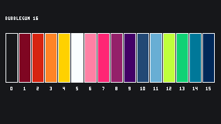

# gfx · Palette

A colour is a number from `0` to `15`, and what each number shows is the palette. **The palette belongs to the game**: a new game starts on Bubblegum 16, the ART tab's Palette panel edits any entry (with Presets to start from and Reset to go back), and the functions below change it from code.

Every colour name in the examples of this documentation ("white", "yellow") is read on Bubblegum 16. A game on another palette shows the same numbers as other colours.

## The default palette

| Index | Colour     | Hex       |
| ----- | ---------- | --------- |
| `0`   | black      | `#16171a` |
| `1`   | dark red   | `#7f0622` |
| `2`   | red        | `#d62411` |
| `3`   | orange     | `#ff8426` |
| `4`   | yellow     | `#ffd100` |
| `5`   | white      | `#fafdff` |
| `6`   | pink       | `#ff80a4` |
| `7`   | hot pink   | `#ff2674` |
| `8`   | plum       | `#94216a` |
| `9`   | purple     | `#430067` |
| `10`  | navy       | `#234975` |
| `11`  | light blue | `#68aed4` |
| `12`  | lime       | `#bfff3c` |
| `13`  | green      | `#10d275` |
| `14`  | teal       | `#007899` |
| `15`  | dark blue  | `#002859` |



> [!NOTE]
> Games made before the palette became editable were drawn on PICO-8's colours, and keep them: an old game's `12` is still that game's sky blue.

## Colour 0 and transparency

Colour `0` is a colour like any other for shapes, pixels, text and [[gfx.clear]]. **Sprites, sheet regions and the map skip it** by default, so the sheet's background does not cover what is behind: [[gfx.draw_sprite]] and [[gfx.draw_region]] take a `transparent` argument to key out another colour instead, or `nil` to draw every colour.

## Two ways to change a colour

There are two mechanisms, and they act at different moments.

A **draw remap** ([[gfx.set_col]]) changes the number that gets written while drawing: after `gfx.set_col(9, 2)`, every pixel that would have been `9` is stored as `2`. It is baked into the frame, so [[gfx.get_pixel]] reads `2`, and it stays on until [[gfx.reset_col]], across frames.

The **screen palette** ([[gfx.set_color]], [[gfx.screen_col]], [[gfx.set_palette_row]]) changes what a number shows when the frame is displayed. The frame still holds `9`; the screen shows whatever `9` now means, for everything drawn this frame, HUD included. It costs nothing per draw call and stays until [[gfx.reset_palette]].

```
   _draw()                           display
   +-------------+   set_col     +---------+   set_color, screen_col,
   | draw calls  | ------------> | frame   |   set_palette_row
   | colour 9    |  written as 2 | holds 2 | ------------------------> pixels
   +-------------+               +---------+   2 shown as its RGB
```

## Remapping colours while drawing

`set_col` swaps one index for another for everything drawn afterwards, sprites, shapes, map and text alike, and `reset_col` puts it back. **Reset before the next thing you draw plain**, or the whole screen stays tinted, this frame and the next.

```lua
local enemies = { { spr = 2, x = 40, y = 60 }, { spr = 2, x = 90, y = 60, hit = true } }

function _draw()
  gfx.clear(0)
  for _, e in ipairs(enemies) do
    if e.hit then gfx.set_col(2, 5) end   -- red drawn as white
    gfx.draw_sprite(e.spr, e.x, e.y)
    gfx.reset_col()
  end
end
```

, and plain again once reset_col has been called.")

{{api:gfx.set_col}}

{{api:gfx.reset_col}}

## Changing the palette itself

These change what a number means at display time, for every sprite and shape that uses it. `reset_palette` puts the game's own palette back.

{{api:gfx.set_color}}

{{api:gfx.get_color}}

{{api:gfx.set_palette_row}}

{{api:gfx.reset_palette}}

## Remapping the finished screen

`screen_col` copies the colour of one entry over another in the screen palette, per row if asked, so the whole frame changes at once without a draw call. Unlike the drawing remap, **it stays until the palette is reset**.

{{api:gfx.screen_col}}
