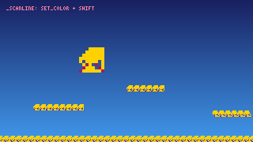
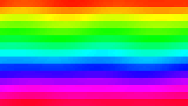

# gfx · Rendering

Everything the screen shows goes through `gfx`: the console is **320 × 180 pixels with 16 palette colours**, drawn again from scratch every frame inside `_draw()`, then shown line by line by a display beam that a `_scanline(y)` function can steer.

The origin is the top-left corner, `x` grows to the right and `y` downwards, and every position is floored to a whole pixel before it is drawn. The [coordinates](/learn/concepts/coordinates) page has the full model.

## The frame

Clear the screen first, then draw over it. Some settings outlive the frame: **the camera, the clip, a `set_col` remap, the frame palette and the frame shift stay as they are** until you change them, so a camera set in `_init()` holds for the whole game and a remap forgotten in `_draw()` tints the next frame too. What a `_scanline` sets is the exception: it lasts one frame.

The camera moves what is drawn and what [[gfx.get_pixel]] reads. It moves neither the clip rectangle, which is in screen pixels, nor [[gfx.clear]], which fills the whole screen whatever the camera and the clip say.

{{api:gfx.clear}}

{{api:gfx.width}}

{{api:gfx.height}}

{{api:gfx.camera}}

{{api:gfx.clip}}

## Sprites and the map

Sprites come from the sheet the ART tab edits, by number; the map is drawn with [[map.draw]], documented on the [map](/learn/api/map) page.

{{api:gfx.draw_sprite}}

{{api:gfx.draw_region}}

## Shapes and pixels

A colour is a palette index from `0` to `15`. **An index outside that range wraps around**: `16` draws as `0`, `-1` as `15`, and `3.7` as `3`. No function checks its colour, so nothing stops the game, and nothing draws a random colour either.

{{api:gfx.pixel}}

{{api:gfx.get_pixel}}

{{api:gfx.line}}

{{api:gfx.rect}}

{{api:gfx.fill_rect}}

{{api:gfx.circle}}

{{api:gfx.fill_circle}}

## Text

{{api:gfx.print}}

## Colours

A colour is a number from `0` to `15`, and what each number shows is the palette. **The palette belongs to the game**: a new game starts on Bubblegum 16, the ART tab's Palette panel edits any entry (with Presets to start from and Reset to go back), and the functions below change it from code.

Every colour name in the examples of this documentation ("white", "yellow") is read on Bubblegum 16. A game on another palette shows the same numbers as other colours.

| Index | Colour     | Hex       |
| ----- | ---------- | --------- |
| `0`   | black      | `#16171a` |
| `1`   | dark red   | `#7f0622` |
| `2`   | red        | `#d62411` |
| `3`   | orange     | `#ff8426` |
| `4`   | yellow     | `#ffd100` |
| `5`   | white      | `#fafdff` |
| `6`   | pink       | `#ff80a4` |
| `7`   | hot pink   | `#ff2674` |
| `8`   | plum       | `#94216a` |
| `9`   | purple     | `#430067` |
| `10`  | navy       | `#234975` |
| `11`  | light blue | `#68aed4` |
| `12`  | lime       | `#bfff3c` |
| `13`  | green      | `#10d275` |
| `14`  | teal       | `#007899` |
| `15`  | dark blue  | `#002859` |


> [!NOTE]
> Games made before the palette became editable were drawn on PICO-8's colours, and keep them: an old game's `12` is still that game's sky blue.

### Colour 0 and transparency

Colour `0` is a colour like any other for shapes, pixels, text and [[gfx.clear]]. **Sprites, sheet regions and the map skip it** by default, so the sheet's background does not cover what is behind: [[gfx.draw_sprite]] and [[gfx.draw_region]] take a `transparent` argument to key out another colour instead, or `nil` to draw every colour.

### Remapping colours while drawing

A **draw remap** ([[gfx.set_col]]) changes the number that gets written while drawing: after `gfx.set_col(9, 2)`, every pixel that would have been `9` is stored as `2`, for sprites, shapes, map and text alike. It is baked into the frame, so [[gfx.get_pixel]] reads `2`, and it stays on until [[gfx.reset_col]], across frames. **Reset before the next thing you draw plain**, or the whole screen stays tinted, this frame and the next.

```lua
local enemies = { { spr = 2, x = 40, y = 60 }, { spr = 2, x = 90, y = 60, hit = true } }

function _draw()
  gfx.clear(0)
  for _, e in ipairs(enemies) do
    if e.hit then gfx.set_col(2, 5) end   -- red drawn as white
    gfx.draw_sprite(e.spr, e.x, e.y)
    gfx.reset_col()
  end
end
```

, and plain again once reset_col has been called.")

{{api:gfx.set_col}}

{{api:gfx.reset_col}}

## The display beam

`_draw()` fills the frame with colour numbers. Then the console shows it the way a CRT did: **a beam reads the frame one line at a time, from line `0` at the top to line `179`**, and turns each number into a colour through the palette. If the game defines a global `_scanline(y)`, the beam calls it just before it shows line `y`, 180 times per frame.

{{svg:img/beam.svg}}

The palette and display functions ([[gfx.set_color]], [[gfx.get_color]], [[gfx.screen_col]], [[gfx.reset_palette]], [[gfx.shift]], [[gfx.blank]]) are the same in both places, and what they act on depends on where they are called:

- **Anywhere but `_scanline`** (in `_init`, `_update` or `_draw`): they change the **frame**: every line, kept from frame to frame until reset. `gfx.shift(dx, dy)` here is a screenshake; `gfx.set_color(0, "#402010")` here tints the whole background for as long as you like.
- **Inside `_scanline(y)`**: they change **line `y` and every line below it**, until a later line changes it again, for this frame only. The beam starts every frame from the frame state, so nothing a line sets leaks into the next frame.

Unlike [[gfx.set_col]], none of this touches the frame: [[gfx.get_pixel]] still reads the number that was drawn, and a HUD drawn in colour `5` shows whatever `5` means on its line.

> [!TIP]
> `_scanline` shares the instruction budget of the step with `_update` and `_draw`, and runs 180 times a frame. Keep each call to a few lines: compute tables in `_init`, and change the palette only on the lines where something changes (`if y % 12 == 0 then …`).

### A gradient the game never drew

The scene draws its sky as plain colour `0`; the beam repaints colour `0` on every line, and shifts the lower third by a sine of its line for a heat haze.

```lua
function _draw()
  gfx.clear(0)
  map.draw(0, 180 - map.height() * 8)
  gfx.draw_sprite(1, 100, 60, 1, 1, false, false, 4)
end

function _scanline(y)
  local t = y / 179
  gfx.set_color(0, 24 + 40 * t, 32 + 120 * t, 96 + 140 * t)
  if y >= 120 then
    gfx.shift(math.sin((y + sys.frame()) / 9) * 6, 0, true)
  end
end
```



### 240 colours from sixteen

A frame holds sixteen numbers, but each band of lines can show them as sixteen colours of its own. Fifteen bands of twelve lines, each given its own palette on its first line, show 240 colours in a picture drawn once with sixteen indices.

```lua
local BAND = 12
local bands = {}   -- bands[b][i]: the colour band b shows for index i, filled in _init

function _scanline(y)
  if y % BAND == 0 then
    local band = bands[y // BAND + 1]
    for i = 0, 15 do
      gfx.set_color(i, band[i][1], band[i][2], band[i][3])
    end
  end
end
```



### A photograph, band by band

The same trick shows a photograph: the picture is reduced to 320 × 180 and every band of twelve lines is quantised to its own best sixteen colours, so the beam sets fifteen palettes a frame while the frame itself holds nothing but numbers from `0` to `15`.


{{api:gfx.set_color}}

{{api:gfx.get_color}}

{{api:gfx.screen_col}}

{{api:gfx.reset_palette}}

{{api:gfx.shift}}

{{api:gfx.blank}}
