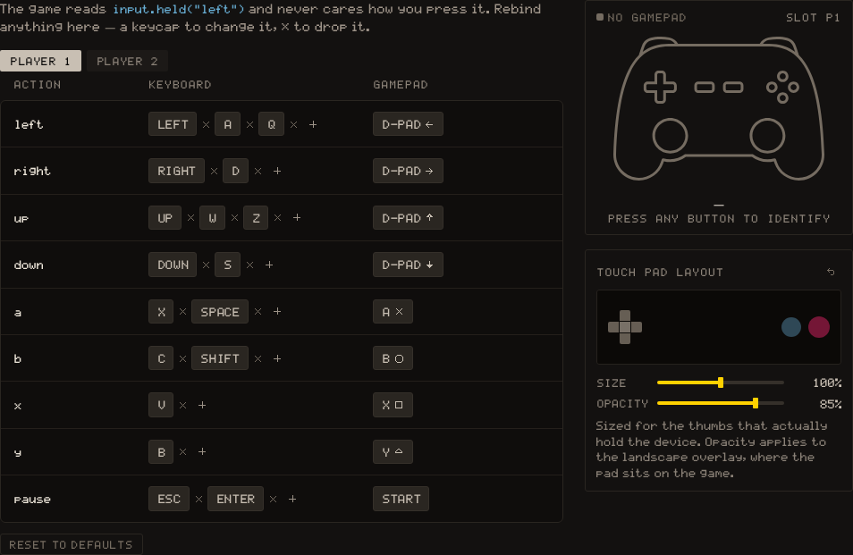

# input · Keys, buttons and the mouse

Two ways to read the player. **Actions** (left, right, up, down, a, b, x, y, pause) are what the console maps to the keyboard, a gamepad or the touch overlay, and the player can rebind them. Raw keys are read by name. Actions are the portable choice: a game that reads `"w"` does not work on an AZERTY keyboard, nor on a gamepad.

## Actions

`held` is true while the action is held, `pressed` on the step it is pressed, `released` on the step it is released. The words the controls table and the game's "how to play" panel show for each action are typed in the [GAME tab](/learn/editors/game), under Controls, not in code.

The default bindings, which the player can change in Settings → Controls:



| Action | Player 1 keyboard | Player 2 keyboard | Gamepad |
| --- | --- | --- | --- |
| `left` `right` `up` `down` | Arrow keys, <kbd>W</kbd><kbd>A</kbd><kbd>S</kbd><kbd>D</kbd> and <kbd>Z</kbd><kbd>Q</kbd><kbd>S</kbd><kbd>D</kbd> | <kbd>I</kbd> <kbd>J</kbd> <kbd>K</kbd> <kbd>L</kbd> | D-pad or left stick |
| `a` | <kbd>X</kbd>, <kbd>Space</kbd> | <kbd>N</kbd> | Button 0 (A / Cross) |
| `b` | <kbd>C</kbd>, <kbd>Shift</kbd> | <kbd>M</kbd> | Button 1 (B / Circle) |
| `x` | <kbd>V</kbd> | <kbd>,</kbd> | Button 2 (X / Square) |
| `y` | <kbd>B</kbd> | <kbd>.</kbd> | Button 3 (Y / Triangle) |
| `pause` | <kbd>Esc</kbd>, <kbd>Enter</kbd> | <kbd>P</kbd> | Button 9 (Start) |

The keyboard and the first gamepad are player 1 together; a second gamepad is player 2, and so on up to four. **The second keyboard layout also plays as player 2**, whether or not a gamepad is plugged in.

A jump reads the press, not the hold, or the player flies while the key is down:

```lua
local player = { x = 40, y = 40, vy = 0, on_ground = true }

function _update()
  if input.pressed("a") and player.on_ground then
    player.vy = -6
    player.on_ground = false
  end
end
```

{{api:input.held}}

{{api:input.pressed}}

{{api:input.released}}

{{api:input.players}}

## Raw keys

Key names are the browser's `event.key` values, and they are **case-sensitive and layout-dependent**: with <kbd>Shift</kbd> held the A key reports `"A"`, not `"a"`, and the key next to <kbd>Tab</kbd> reports `"q"` on a French keyboard. That is why the default bindings list both cases and both layouts.

{{api:input.key_pressed}}

{{api:input.key_down}}

| Key         | String         |
| ----------- | -------------- |
| Left arrow  | `"ArrowLeft"`  |
| Right arrow | `"ArrowRight"` |
| Up arrow    | `"ArrowUp"`    |
| Down arrow  | `"ArrowDown"`  |
| Space bar   | `" "`          |
| Shift       | `"Shift"`      |
| Enter       | `"Enter"`      |
| A key       | `"a"`          |

## The mouse

Positions are in screen pixels, `0` to `319` across and `0` to `179` down, and the camera does not move them. Buttons: **`0` is the left button, `1` the right, `2` the middle.**

{{api:input.get_mouse_pos}}

{{api:input.mouse_pressed}}

{{api:input.mouse_down}}
