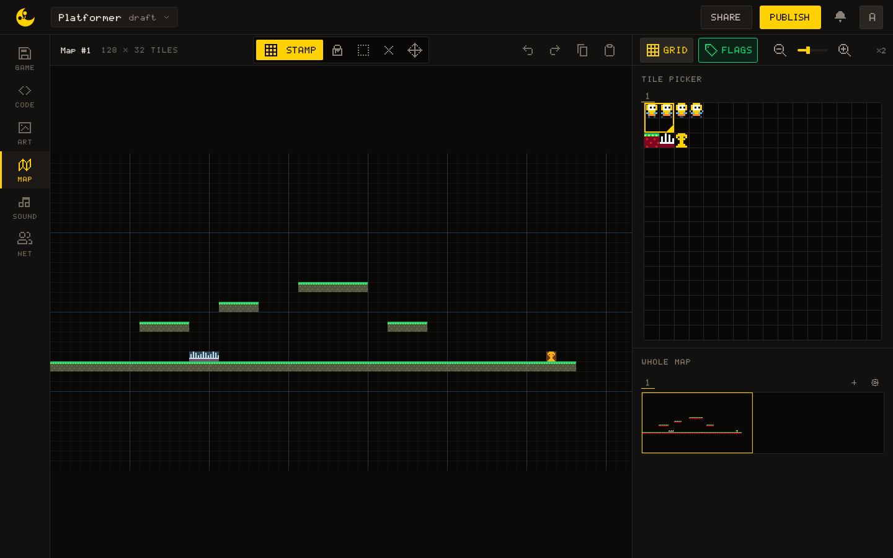

# map · Tilemap

The map is the grid of sprite numbers the MAP tab paints, **tiles of 8 × 8 pixels**, read by the same numbers the sheet gives them. The game draws it with `draw`, reads a tile with `get`, changes one for the current run with `set`, and asks a sprite what it means with `flag`.

The pictures on this page come from a demo game: a new game's sheet with a small ship drawn on sprite 0, and a demo map, a floor and three platforms drawn with a brick tile on sprite 32.

A game can hold several maps. Every function but `flag` takes the map's number as its last argument, **counted from `1`** in the order of the MAP tab's strip, and works on the first map without it. Asking for a map the game does not have prints one warning in the console, once per function and map; then `draw` and `set` do nothing, and `get`, `width` and `height` answer `0`.

## Drawing it

{{api:map.draw}}

`tx`, `ty`, `tw`, `th` name a window of the map in tiles, so one call draws a room of it:

: a 12 × 8 window of the map, twelve rows above its floor, drawn at (40, 20) and outlined.")

## Reading and changing tiles

The painted map is the level's data: read the tile under a point to know what is there, and the flags of that sprite to know what it means. **Out of the map, `get` answers `0`**, which is sprite 0, so guard your bounds where sprite 0 carries a flag. A `set` lasts for the run only: reloading the game brings the painted level back.



{{api:map.get}}

{{api:map.set}}

{{api:map.flag}}

## Size

A game chooses its own map size, from 1 to 256 tiles a side, so read it rather than assuming one.

{{api:map.width}}

{{api:map.height}}

## From a pixel to a tile

The map functions count tiles, the drawing functions count pixels. A point at `(37, 50)` sits on the tile `(4, 6)`: divide each coordinate by `8` and floor it. Read that tile's sprite, then the sprite's flags.

{{svg:img/pixel-to-tile.svg}}

The usual collision test, with the bounds guarded:

```lua
local TILE_SIZE = 8
local FLAG_SOLID = 0

local function is_solid_at_pixel(x, y)
  local tx = math.floor(x / TILE_SIZE)
  local ty = math.floor(y / TILE_SIZE)
  -- Outside the map, map.get answers 0, which is a real sprite: treat the outside as empty.
  if tx < 0 or tx >= map.width() or ty < 0 or ty >= map.height() then
    return false
  end
  return map.flag(map.get(tx, ty), FLAG_SOLID)
end
```
