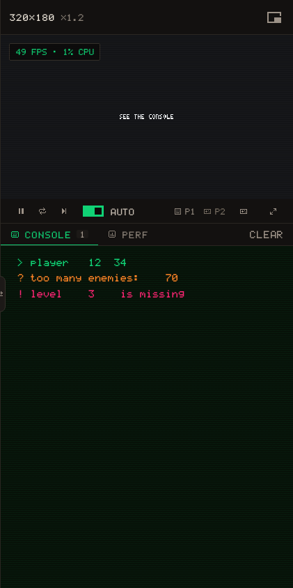

# sys · Time, frames and the console

What the game cannot get from drawing or input: the clock, and a way to say something. Everything printed lands in the **console** under the viewer in the editor, never on the screen.

## Time

The game runs `_update` at a fixed 60 steps per second (see the [game loop](/learn/concepts/game-loop)), so `dt` is the same number every step; multiply a speed by it all the same, and count in `frame` or `time` for anything that must stay in step with the game.

{{api:sys.dt}}

{{api:sys.frame}}

{{api:sys.time}}

{{api:sys.fps}}

## The console

`print` is the same function as `log`. `warn` and `error` only colour the line: neither stops the game. A Lua error raised by `error(...)` or a bug does stop it, and shows here too.

{{api:sys.log}}

{{api:sys.warn}}

{{api:sys.error}}

> [!TIP]
> Print freely while building, and take the prints out when it works: they cost nothing on screen, but a console that scrolls is a console nobody reads.
