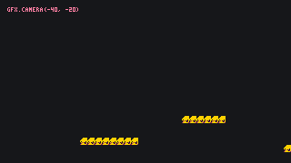
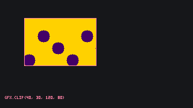

# Coordinates and Rendering Model

This page is the map of every number you pass to a drawing function: screen pixels, the camera that shifts them, the clip that cuts them, and the sprite and tile numbers that name a picture. It ends with what the screen actually is, an array of palette indices.

## The screen

The screen is **320 × 180 pixels**, which [[gfx.width]] and [[gfx.height]] return. `(0, 0)` is the top-left corner, `x` grows to the right and `y` grows downward, so the bottom-right pixel is `(319, 179)`. Every drawing function takes pixel coordinates, and positions are floored to whole pixels.

```
(0,0) ---------------------- (319,0)
  |                            |
  |                            |
  |         320 x 180          |
  |                            |
  |                            |
(0,179) --------------------- (319,179)
```

The mouse is in the same space: [[input.get_mouse_pos]] returns screen pixels, and `nil` while the pointer is outside the screen.

## The camera

[[gfx.camera]] shifts every later draw call. With the camera at `(x, y)`, something drawn at `(px, py)` lands at `(px - x, py - y)`, so a camera at `(40, 0)` scrolls the whole world 40 pixels to the left. The value is floored.

The camera is **not reset between frames**. Set it once in `_init` and it stays; set it to follow the player in `_draw` and it keeps the last value into the next frame, which is what you want for a scrolling world and a surprise for the HUD drawn afterwards. `gfx.camera()` with no arguments puts it back at the origin.

``` lua
local player = { x = 500, y = 120 }

function _draw()
  gfx.clear(0)
  gfx.camera(player.x - 160, player.y - 90)   -- the world moves
  map.draw(0, 0)
  gfx.fill_rect(player.x, player.y, 8, 8, 4)
  gfx.camera()                                -- the HUD does not
  gfx.print("score 0", 4, 4, 5)
end
```



## The clip

[[gfx.clip]] keeps every later draw call inside a rectangle. The rectangle is in **screen pixels**: the camera does not move it. A new clip replaces the old one, `gfx.clip()` opens the whole screen again, and [[gfx.clear]] ignores the clip and wipes everything.



## Sprites

The ART tab edits sprite sheets made of **8 × 8 tiles**. A new game has one sheet of 128 × 128 pixels: 16 sprites per row, 256 sprites numbered `0` to `255`, left to right then top to bottom. Sprite `0` is the top-left cell, sprite `16` the first of the second row.

    Row 0:   [ 0][ 1][ 2][ 3] ... [15]
    Row 1:   [16][17][18][19] ... [31]
    Row 2:   [32][33][34][35] ... [47]
    ...
    Row 15:  [240] ...           [255]

On that first sheet, the sprite at column `c` and row `r` is `r * 16 + c`. A sheet can be resized to anything from 8 to 256 pixels a side in steps of 8, and a game can have several sheets: the numbers then **run on from one sheet to the next**, so the second sheet starts where the first ended, and `16` in the formula becomes whatever the sheet's own width in sprites is.

[[gfx.draw_sprite]] draws one sprite, or a block of `w × h` of them starting at a number, optionally flipped and scaled. [[gfx.draw_region]] instead copies any rectangle of pixels of the first sheet, named in sheet pixels; it is how the starter game draws its 16 × 16 moon out of sprites 1, 2, 17 and 18.

``` lua
-- a 16 × 16 character stored in sprites 0, 1, 16 and 17, drawn twice its size
gfx.draw_sprite(0, 100, 60, 2, 2, false, false, 2)
-- the same pixels, named as a rectangle of the sheet
gfx.draw_region(0, 0, 16, 16, 100, 60, 32, 32)
```

## Map tiles

A map is a grid of sprite numbers, one per **8 × 8 tile**. Tile coordinates count tiles, not pixels: `map.get(3, 2)` is the sprite at the fourth column of the third row, drawn 24 pixels from the left and 16 from the top of wherever [[map.draw]] put the map. A new map is 128 × 32 tiles (1024 × 256 pixels); the MAP tab can make one anything from 1 to 256 tiles a side, and a game can have several maps, numbered from `1` in the order of the MAP tab's strip.

> [!NOTE]
> Tile `0` is always drawn empty, so sprite `0` never appears on a map. Keep it blank, or use it as your eraser.

## What the screen is made of

The screen is not a picture but an array of **palette indices**, one per pixel, from `0` to `15`. Drawing functions write indices; the palette turns them into colours only at display time, which is why [[gfx.set_col]] can recolour what is already drawn and why a colour index above 15 wraps around (17 draws as 1).

Nothing erases the array for you: what `_draw` does not overwrite stays from the previous frame, so a frame usually opens with [[gfx.clear]]. Between the array and the display sit the per-row effects of [[gfx.scanline]], which shift, tint or swap palette rows for one frame. The [Palette](/learn/api/gfx-palette) page covers the rest.
