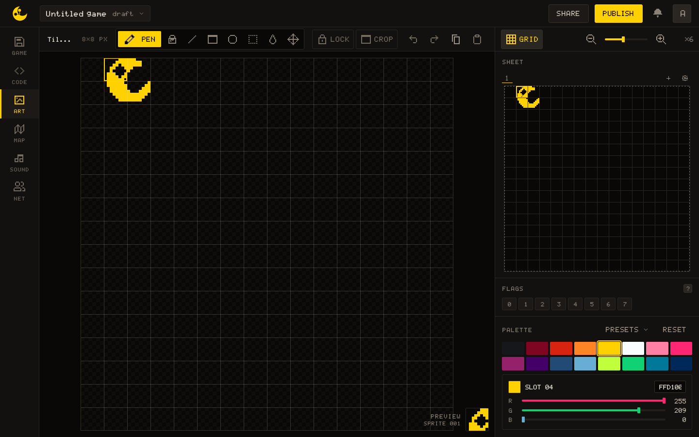
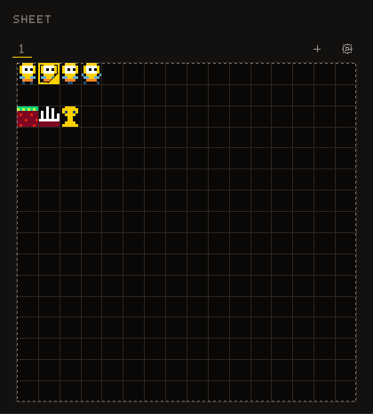
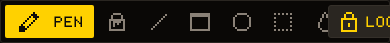
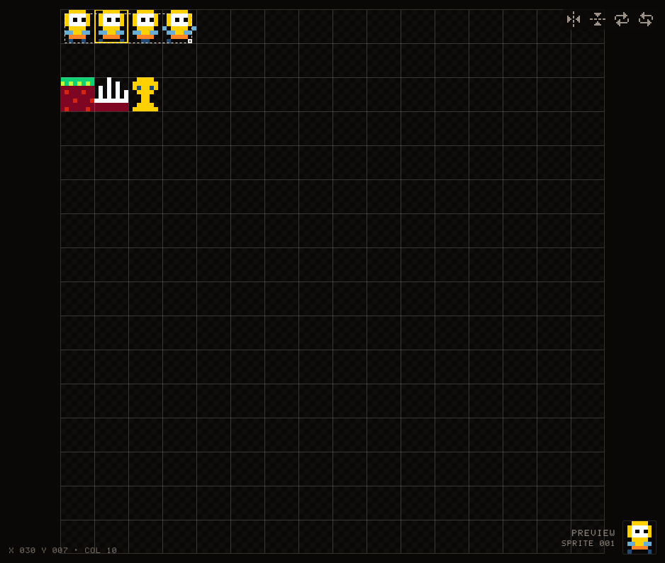
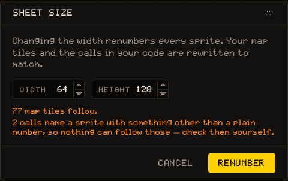
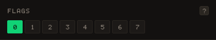
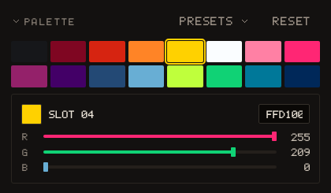
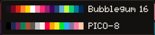

# ART

The ART tab is where you draw the sprites of your game: characters, tiles, objects, everything a call to [[gfx.draw_sprite]] puts on screen. It is written for whoever holds the pen; the Lua side is one short section at the end.



## The sheet

A new game has one sheet of **128 × 128 pixels**, cut into cells of 8 × 8. Each cell is a sprite, numbered from `0` left to right and top to bottom: sixteen per row, 256 in all. That number is what your code hands to [[gfx.draw_sprite]]. A sheet and a **tileset** are the same thing: the header here and the MAP tab, which stamps its tiles from a sheet, call it a tileset.

The canvas in the middle shows the whole sheet. The gold outline on it is the **region**: the cells you are working on, and what the FLAGS panel writes to. The header names the sheet (`Tileset #1`), then the region's size in cells when it is bigger than one, then its size in pixels. PREVIEW, at the bottom right of the canvas, shows the region at its real size, and under it `SPRITE 001` is the number of the region's first cell.

At the bottom left, `X 000 Y 000 · COL 00` follows the pointer: the sheet pixel under it and the colour it holds.

### The SHEET panel



The small map of the sheet at the top of the right panel is where the region is chosen. **Drag on it** to frame any rectangle of cells: one for a single sprite, 2 × 2 for a character that spans four. With the map focused, the arrow keys move the region one cell at a time and <kbd>Shift</kbd> + arrows resize it. A middle-button drag on the map scrolls the canvas to that spot.

The strip above the map has a tab per sheet, a `+` that adds one and a gear that opens the Sheet size dialog. Both are covered below.

## Looking at the sheet

The bar above the panel and the two toggles in the header set how the sheet is shown. None of them changes the drawing.

| Control | What it does                                                                                                                     |
| ------- | -------------------------------------------------------------------------------------------------------------------------------- |
| Grid    | On by default: the cell lines over the canvas                                                                                    |
| Crop    | Shows only the region, fitted to the panel, once the neighbours stop mattering                                                   |
| Onion   | Only while Crop is on: ghosts the cells one region's width to the left, so the previous frame of an animation shows under this one |
| Lock    | An option, off by default: on, a stroke stops at the region's edge instead of running onto the neighbouring cells. Hidden while Crop is on, there being nothing outside the region to reach. On a laptop-wide window Lock and Crop show their icon alone |
| Zoom    | `×1` to `×64` with the `−` and `+` buttons, the slider, or <kbd>Ctrl/⌘</kbd> + wheel; the `×N` readout fits the sheet to the panel again |

> [!TIP]
> The wheel on its own scrolls the canvas. Hold <kbd>Ctrl/⌘</kbd> to zoom.

## The tools



Eight tools, each with a one-letter key. Pick a colour in the PALETTE panel, then draw on the canvas.

| Tool   | Key            | What it does                                                        |
| ------ | -------------- | ------------------------------------------------------------------- |
| Pen    | <kbd>P</kbd>   | Paints pixels; a drag draws a continuous stroke                     |
| Fill   | <kbd>F</kbd>   | Floods a patch of one colour                                        |
| Line   | <kbd>L</kbd>   | Drag from one end to the other                                      |
| Rect   | <kbd>R</kbd>   | Drag a rectangle outline                                            |
| Circle | <kbd>C</kbd>   | Drag an ellipse outline                                             |
| Select | <kbd>S</kbd>   | Drag a rectangle of pixels to transform, copy or move               |
| Pick   | <kbd>I</kbd>   | Takes the colour under the pointer as the current colour            |
| Move   | <kbd>M</kbd>   | Drags the selection, or the whole region when nothing is selected   |

Whatever the tool, the **right button paints colour 0**, which is how you erase: colour 0 is the transparent one when the sprite is drawn.

## Selection and clipboard

### Selection

With Select, drag a rectangle on the canvas. A transform bar appears at the top right of the canvas with four buttons: flip horizontally, flip vertically, rotate clockwise, rotate counter-clockwise. The same four are <kbd>Shift</kbd>+<kbd>H</kbd>, <kbd>Shift</kbd>+<kbd>V</kbd>, <kbd>]</kbd> and <kbd>[</kbd>. <kbd>Delete</kbd> or <kbd>Backspace</kbd> clears the selected pixels to colour 0.



### Clipboard

<kbd>Ctrl/⌘</kbd>+<kbd>C</kbd> copies the selection, or the **whole region** when nothing is selected. <kbd>Ctrl/⌘</kbd>+<kbd>X</kbd> cuts, and needs a selection. <kbd>Ctrl/⌘</kbd>+<kbd>V</kbd> pastes as a floating block and switches to Move: drag it where it goes, then <kbd>Enter</kbd> settles it and <kbd>Esc</kbd> discards it. Starting any other stroke settles it too. The Copy and Paste buttons at the right of the header do the same.

### Undo

The two arrows in the header, <kbd>Ctrl/⌘</kbd>+<kbd>Z</kbd> and <kbd>Ctrl/⌘</kbd>+<kbd>Shift</kbd>+<kbd>Z</kbd> or <kbd>Ctrl/⌘</kbd>+<kbd>Y</kbd>. The history covers pixels, flags and the palette, and also adding, renaming and deleting a sheet.

## Sheet size

The gear of the SHEET strip opens the **Sheet size** dialog: a width and a height from 8 to 256 pixels, in steps of 8. A sheet is always a whole number of cells across and down.



Changing the width is not a small thing. The picture stays where it is, but the grid of numbers reflows over it, so a sprite number comes to mean a different cell, and so does every number on every sheet after this one. The editor follows through: the dialog counts what it will move (`N map tiles follow`, `N calls in your code are rewritten`) and the button is called **Renumber**. A call that names a sprite with something other than a plain number cannot be followed, and the dialog says how many of those there are so you can check them yourself.

Making a sheet smaller does not delete what falls outside it. The dialog counts the drawn sprites that would go out of reach; they stay in the file and come back if the sheet grows again.

> [!WARNING]
> After a resize, reread any code that computes a sprite number (`base + frame`, a table of numbers built in a loop): the renumbering rewrites literals only.

## Several sheets

The `+` of the SHEET strip adds a sheet at the same size as the first one. Each tab in the strip is a sheet: double-click it, or click its pencil, to give it a **name and a colour**; its cross deletes it after a confirmation, and its art goes with it.

Sprite numbers run on from one sheet to the next. With a first sheet of 128 × 128, the first cell of the second sheet is sprite `256`, and the header of ART shows that number under PREVIEW when you select it. Deleting a sheet shifts the numbers after it down, so code that named one of them will point at the next sprite along.

The MAP tab stamps tiles from any sheet. [[gfx.draw_region]], which copies a rectangle of pixels rather than whole sprites, reads the first sheet only.

## Flags



Every sprite carries **eight bits**, numbered 0 to 7, and the FLAGS panel shows the ones set on the region's first cell. Clicking a bit toggles it on every cell of the region, so a sprite that spans several cells keeps one set of flags. There is no numeric field: the eight buttons are the whole panel.

The engine gives the bits no meaning. Your game reads them with [[map.flag]] and decides that bit 0 means solid, bit 2 means water, and so on. The MAP tab can tint tiles by their first flag, which is the quickest way to check a level's collision.

> [!WARNING]
> The panel writes bits on a sprite of any sheet, but [[map.flag]] reads the **first sheet only**: for a sprite of a second sheet it answers `0` whatever the panel shows. Keep the sprites whose flags matter, the solid tiles, on the first sheet.

``` lua
-- bit 0 of sprite 17, true or false
if map.flag(17, 0) then
  -- solid
end

-- all eight bits at once, as a number from 0 to 255
local bits = map.flag(17)
```

## Palette





The palette is **sixteen colours for the whole game**, shared by every sheet and every map. Click a slot to draw with it; below the grid, the slot's number, its hex value and three R/G/B sliders let you change the colour itself. Every pixel drawn with that slot changes with it, on every sheet.

The default is Bubblegum 16. The **Presets** menu applies Bubblegum 16 or PICO-8 to the sixteen slots, and Reset puts Bubblegum 16 back. Both are undoable, like any edit to a slot.

> [!NOTE]
> What a game does with [[gfx.set_color]] while it runs lasts for that run only. The palette the editor shows is the one the next run starts from.

## Sprites in Lua

Sprites are named by number. A block of cells is one call with a width and a height in cells:

``` lua
local player = { x = 40, y = 40 }

function _draw()
  gfx.clear(0)
  gfx.draw_sprite(0, player.x, player.y)          -- one 8×8 sprite
  gfx.draw_sprite(16, 80, 40, 2, 2)               -- a 16×16 block: cells 16, 17, 32, 33
  gfx.draw_sprite(256, 120, 40)                   -- the first sprite of the second sheet
  gfx.draw_region(0, 8, 24, 8, 160, 40, 48, 16)   -- 24×8 pixels of the first sheet, doubled
end
```

Give the numbers names at the top of a tab (`SPRITE_IDLE = 0`) rather than repeating them, and keep the frames of one animation side by side so a loop can step through them. See [[gfx.draw_sprite]] and [[gfx.draw_region]] for every argument.
