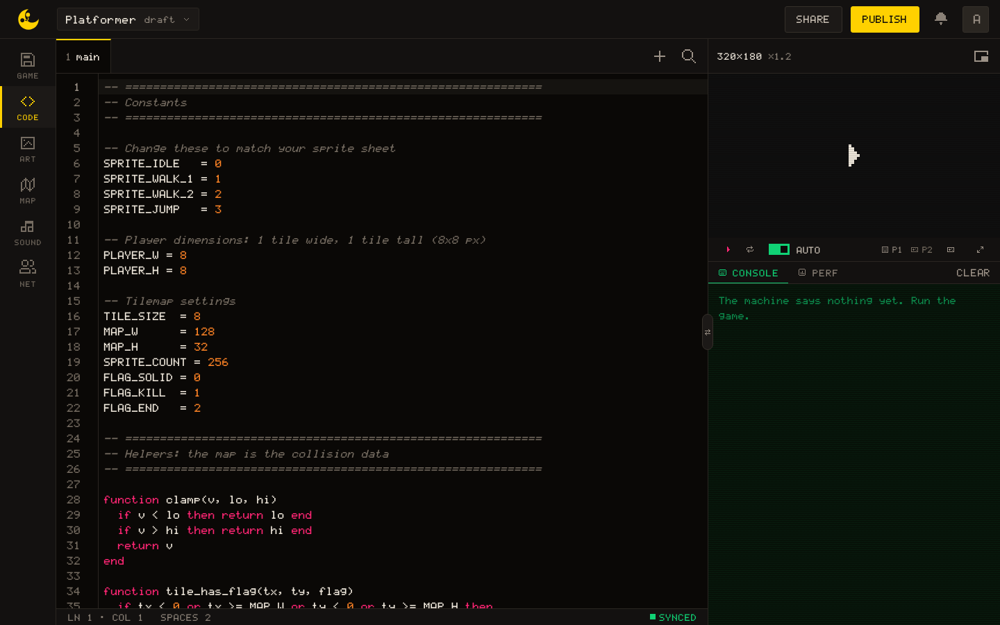
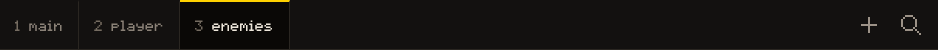
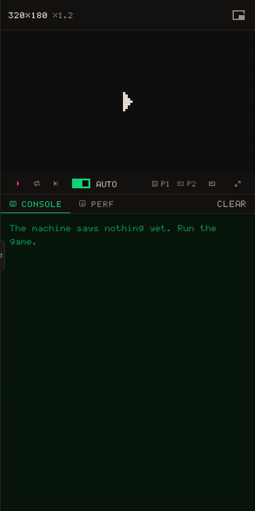
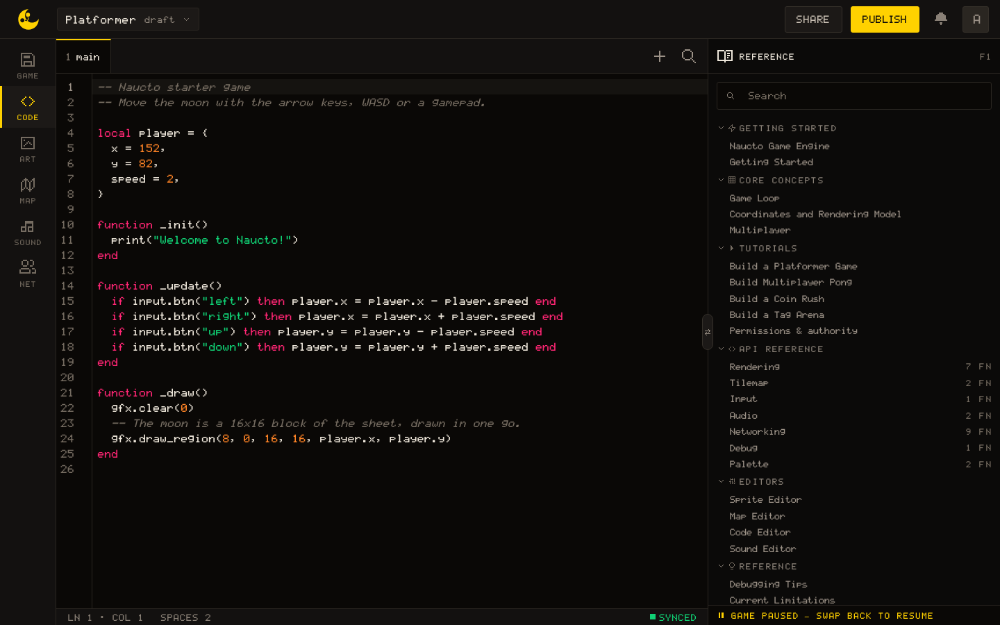
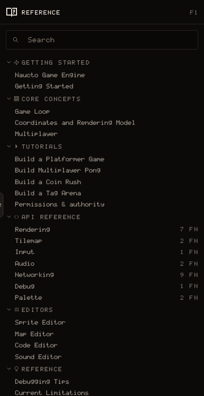

# CODE

The CODE tab is where you write the Lua of your game. The editor takes the middle of the screen, the running game and its console take the column at the right, and the reference opens beside them with <kbd>F1</kbd>. This page describes the three; what the Lua itself has to look like is in [game loop](/learn/concepts/game-loop).



## The editor

The editor is CodeMirror 6, set up for Lua. Brackets and quotes close themselves, the matching bracket lights up, every other occurrence of the selected word is highlighted, and <kbd>Tab</kbd> indents by **two spaces**. The status bar at the foot reads `LN 12 · COL 4 · SPACES 2`.

Typing the name of an API function offers completions; resting the pointer on one shows its card; inside its parentheses, a signature help names the argument you are on. That help also knows the **functions your own tabs declare**, whichever tab they are written in.

The right end of the status bar says where your work stands: **Synced** when the server has everything, `Unsaved changes` while an edit is waiting, `Syncing` while it goes, `Not saved` when a write was refused. Saving is automatic; naming a version of the game is done in [GAME](/learn/editors/game).

### Find and replace

The magnifier in the tab strip, or <kbd>Ctrl/⌘</kbd>+<kbd>F</kbd>, opens the Find bar under the editor. It has `Match case`, `Regexp` and `Whole word`, arrows for the previous and next match, and a button that selects every match at once. <kbd>Ctrl/⌘</kbd>+<kbd>G</kbd> and <kbd>Shift</kbd>+<kbd>Ctrl/⌘</kbd>+<kbd>G</kbd> walk the matches without leaving the editor. The chevron at the left unfolds a `Replace with` field with **Replace this one** and Replace every one. <kbd>Esc</kbd> closes the bar.

## Errors

When the game throws, the failing line is **underlined and tinted**, with a mark in the gutter and the message on hover. The status bar shows `1 error`, and the Console tab of the column carries a badge with the count. Fix the line; with Auto on, the game reruns by itself.

## Tabs



A game holds as many tabs as it needs. Every launch runs each tab once, **in the order of the strip**, and only then calls `_init`. Drag a tab to change that order; the number beside its name is its rank. A tab is not a module: there is no `require`, and a tab that needs something at the moment it runs, rather than later from inside `_init`, wants the tab that provides it earlier in the strip.

Tabs share through globals. A function or a variable declared at the top level of one tab is there for every tab after it, and for `_init`, `_update` and `_draw` wherever they are written:

``` lua
-- tab 1, "helpers"
function clamp(v, lo, hi)
  if v < lo then return lo end
  if v > hi then return hi end
  return v
end

-- tab 2, "main"
local x, dx = 40, 1

function _update()
  x = clamp(x + dx, 0, 320)
end
```

The `+` opens the **New tab** dialog: a name of up to 24 characters that holds no colon and is not the name of a Lua library (`math`, `string`, `table` and so on), and a colour from the palette for the tab. Double-click a tab, or click its pencil, to rename or recolour it. Its cross removes it after a confirmation: the tab and its code go, for everyone in the session, and that cannot be undone.

## Every launch starts clean

The globals go, the palette and the camera come back to what the editors show, the sound stops, and a tile written with [[map.set]] is forgotten. Nothing a running game changes is written back to the project: [[map.set]] and [[gfx.set_color]] last as long as the run.

## The console column



The column at the right of CODE holds the **running game** at its own 320 × 180, scaled to the column. Opening the editor does not launch it; the transport under the screen does: Play or Pause, Restart, Step one frame (one update, pausing a running game first), the gamepad indicators and Fullscreen. Click the screen to give it the keyboard.

The **Auto** switch, on by default, reruns the game 400 ms after every edit, so the screen shows what you just typed. Turn it off while a change spans several tabs.

The pop-out button at the top of the column lifts the screen into a floating window that follows you across the other tabs; **Bring it back** docks it again. While the screen is hidden, because the reference has taken its place or you are on a tab where the viewer is docked, the game is paused, and it resumes when the screen is back.

## Console and Perf

**Console** is what the game says. `print` and [[sys.log]] write a line prefixed `>`, [[sys.warn]] one prefixed `?`, [[sys.error]] and a runtime error one prefixed `!`, and `--- HALTED ---` closes the list when the game stops on an error. Clear empties it.

**Perf** is six readings: `FPS`, `CPU` as a percentage of the frame budget, `FRAME`, `STATE` of the runtime, `PEERS` in the session and `SYNC` with the server.

> [!TIP]
> Print positions and states rather than guessing at them: a `print` in `_update` writes sixty lines a second, so guard it with a condition or a frame count.

## The reference



The reference is this documentation, opened inside the editor. <kbd>F1</kbd> opens it on the card of the **symbol under the caret**: with the caret anywhere in `gfx.draw_sprite`, that function's card. Pressing <kbd>F1</kbd> on another symbol later moves the pane there; moving the caret does not. <kbd>Ctrl/⌘</kbd>+<kbd>K</kbd> opens it with the caret in its search box, which lists the first ten hits as you type. The button on the edge of the column opens and closes it as well, and the editor remembers whether it was open.



From 1602 px wide the pane sits **beside the console**, and the game keeps running. Narrower, it takes the console's place: the foot of the pane says `Game paused — swap back to resume`, and the same edge button swaps back.

A function card and the examples on a page carry **Insert at cursor**, which types the call at the caret in the editor. With the editor out of view, the call goes to the clipboard instead.
