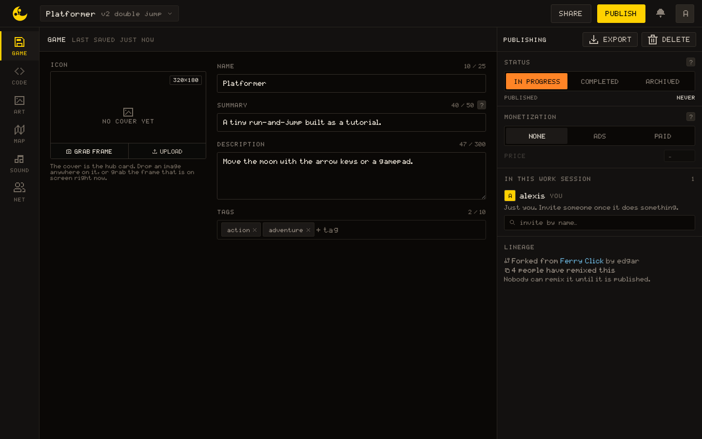
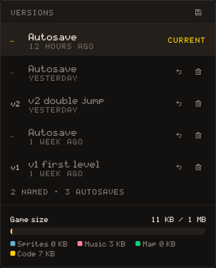
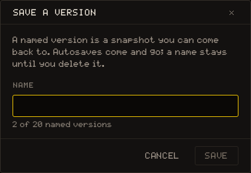
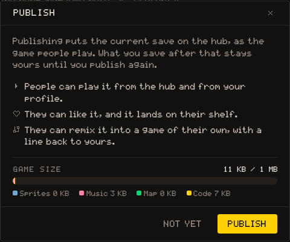
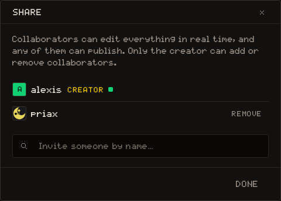

# GAME

The GAME tab is what the game is, who it is for and where it goes: its card on the hub, its publishing status, the people in the work session. The header above every tab belongs here too, with the **versions**, SHARE and PUBLISH.

## The game card

### Icon

The cover is the game's picture on the hub, at **320×180**. Grab frame takes the frame that is on screen right now, so the game has to be running; Upload takes an image file, and you can also drop one anywhere on the cover.

### Name, Summary, Description, Tags

The name is 25 characters at most, the summary 50, the description 300 and there are up to 10 tags, typed one at a time with <kbd>Enter</kbd>. The summary is the line under the game on its hub card and what search shows for it: **say what it is, not how it was made**. The description is the long version, and Markdown is fine.

> [!IMPORTANT]
> A game needs a name and one line of summary before it can be published. The panel says so with a band until both are there.

### Controls

The console has nine actions, `left`, `right`, `up`, `down`, `a`, `b`, `x`, `y` and `pause`, and the code reads them by those names with `input.held`, `input.pressed` and `input.released` (see [input](/learn/api/input)). The Controls block is one row per action with a field for **the word your game gives it**, 25 characters at most: `Jump` beside `a`, `Walk` beside `left`. Leave empty the actions the game does not read.

The names are part of the game document, so they are saved and published with it and need no code. Two places show them: the **How to play** panel on the game's page, which lists only the actions you named, and Settings › Controls, where the label column reads them beside each binding while that game is on screen. A game that names nothing gets the console's own words instead.

## PUBLISHING

The panel on the right. Its head carries two actions, Export and Delete; the sections under them are the game's status, who is here, and where it comes from.

### Status

In progress, Completed or Archived. It is **a note for you and your collaborators, and nothing more**: publishing, not this, is what puts the game on the hub. Under it, the date the game was published, or `never`.

### Monetization

None, Ads or Paid, with a Price field for Paid. Paid games are not charged yet; this only marks the intent, so the hub can show it. The section appears only where the deployment sells games at all.

### IN THIS WORK SESSION

Everyone connected to the game right now, with `you` on your own row. The host has a **Kick** button on every other row. Under the list, `invite by name…` searches for a person and adds them as a collaborator, the same thing the SHARE dialog does.

### Lineage

Where the game comes from: Forked from, with the parent and its creator, and how many people have remixed this one. A game nobody can remix yet says so: **Nobody can remix it until it is published.**

### Export and Delete

Export downloads the whole game as one file, `<name>.ncto`, the same bytes a saved version holds. There is no import in the editor: the file is a backup you keep, or something to inspect.

Delete is the creator's only. It asks, **Delete this game?**, then the game and everything in it goes, and it cannot be undone.

## Versions

The chip at the left of the header names the game and its **newest named version**, or `draft` while there is none. From 90 % of the size ceiling the game's size appears beside it, and turns red once it is over.

The chip opens the versions popover: one list, **newest first**, where named versions (`v1`, `v2`, numbered from the oldest) and autosaves are mixed. The top row is the game as it is, marked Current until someone edits again. Every other row can be restored, with the arrow, or deleted, with the trash. A restore enters the shared document like any edit, so everyone in the session gets it at once. Under the list, `N named · M autosaves`; under that, the Game size gauge (Sprites, Music, Map, Code) against the 1 MB ceiling.

### Save a version

The save icon at the head of the popover opens **Save a version**. Autosaves come and go; a name stays until you delete it.

The name is 32 characters at most. The field says `N of M named versions`, the server's own cap. **Reusing a name overwrites that version** with the game as it is now, and does not count against the cap; at the cap, the way to save is to reuse a name or to delete one first.

## Publish

PUBLISH opens the Publish dialog. Publishing puts the current save on the hub, as the game people play; what you save after that stays yours until you publish again. The dialog lists what a release allows: people can play it from the hub and your profile, like it, and **remix it into a game of their own**, with a line back to yours.

Under that, the same Game size gauge. Over 1 MB the notice says by how much and the button is disabled: everything else still saves, and the game still runs. Before the first release the buttons are Not yet and Publish; once published, **Unpublish** and **Update release**. Each release also leaves a version named `published` in the history, so the state people are playing is always something you can go back to.

The button in the header is greyed, with the reason on hover, while the game is over the ceiling or has no name or summary.

## Share

SHARE opens the collaborators dialog. Collaborators can edit everything in real time, and any of them can publish; only the creator changes who is on the game.

The list is everyone the game belongs to, with CREATOR on the creator's row and a dot on the people who are connected right now. **Only the creator can add or remove collaborators**: for them, `Invite someone by name…` searches by username and Remove takes someone off; everyone else sees the list and the sentence that says so.
