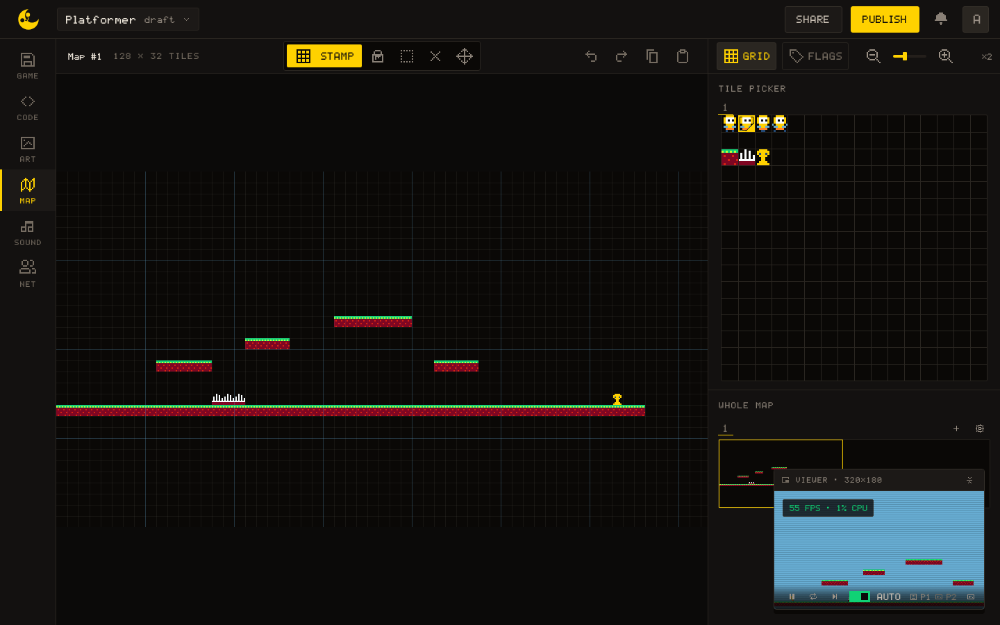

# Editors

A Naucto game is made in one window with six tabs down its left edge. This page says what each tab is for and what they all share; each tab has a page of its own.

## The six tabs

In the order of the rail:

- **[GAME](/learn/editors/game)**: the game's card (cover, name, summary, tags), its publishing status, who is in the work session, export and delete.
- **[CODE](/learn/editors/code)**: the Lua files, the running game beside them, the console and the reference.
- **[ART](/learn/editors/art)**: the sprite sheets, their flags and the palette.
- **[MAP](/learn/editors/map)**: the tile map, painted with the sprites.
- **[SOUND](/learn/editors/sound)**: instruments, patterns on a piano roll, sound effects and musics.
- **[NET](/learn/editors/net)**: the shared state of a multiplayer game, the session and a test rig.

## The common layout

Every tab has the same three parts: the **rail** on the left, the workspace in the middle, and a panel on the right that is the tab's inspector. The panel is the same width everywhere, so switching tabs never moves the workspace.

The console column, with the 320×180 screen and the Console and Perf strips, exists only on CODE. On the other tabs the game keeps running unseen, unless you pop the viewer out.

### The floating viewer

The pop-out button in the console column's head lifts the screen into a **floating card** you can drag by its title bar and resize by its edges. It follows you from tab to tab, so you can watch the game while you paint a sprite or write a pattern, and it may take up to a third of the window. The empty slot it left behind in the console column says where it went; **Bring it back**, there or on the card's title bar, docks it again.

## The header

The header is shared by every tab. From left to right:

- A chip with the game's **name and its newest named version**, or `draft` while none has a name. It opens the versions popover; the game's size appears beside it once it nears the 1 MB ceiling. See [GAME](/learn/editors/game).
- The avatars of the other people in the work session.
- **SHARE**, which opens the collaborators dialog.
- **PUBLISH**. When publishing is not possible the button is greyed and says why on hover: the game is over the size ceiling, or it has no name or no summary yet.

## One URL per tab

Each tab is an address, `/edit/<id>/<tab>`, so a link opens the editor on the tab it names, and back and forward move between tabs. `/edit/<id>` alone lands on GAME. The state of a tab, the tool in hand, the zoom, the grid, the pattern being shown, **survives while the project is open**, whichever tabs you visit in between.

## Working together

Everyone the game is shared with edits it at the same time, and every change reaches the others as it is made. Each person has a colour, and you see them at work:

- their avatars in the header;
- their **pointer on the ART canvas, the MAP canvas and the piano roll**, and over the panels they are about to change (FLAGS and PALETTE in ART, the SOUND inspector, the session panels of NET);
- their caret in CODE, in their colour, with what they select.

Who is in the session, and the Kick button, are on the [GAME](/learn/editors/game) tab.

## Screen size

> [!IMPORTANT]
> The editor needs at least **1024 px** of width. Narrower, the workspace is replaced by "The editor needs a bigger screen", with Copy link, Play it instead and Back to the hub. A window dragged narrow on a desktop gets the same page as a phone.

## Shortcuts across tabs

| Key | Where | Does |
| --- | --- | --- |
| <kbd>Ctrl/⌘</kbd>+<kbd>Z</kbd> | ART, MAP, SOUND | Undo |
| <kbd>Ctrl/⌘</kbd>+<kbd>Shift</kbd>+<kbd>Z</kbd> | ART, MAP, SOUND | Redo |
| <kbd>Ctrl/⌘</kbd>+<kbd>Y</kbd> | ART, MAP, SOUND | Redo |
| <kbd>F1</kbd> | CODE only | The reference, on the symbol under the caret |
| <kbd>Ctrl/⌘</kbd>+<kbd>K</kbd> | CODE only | Search the reference |

Each tab's own shortcuts are listed on its page.
