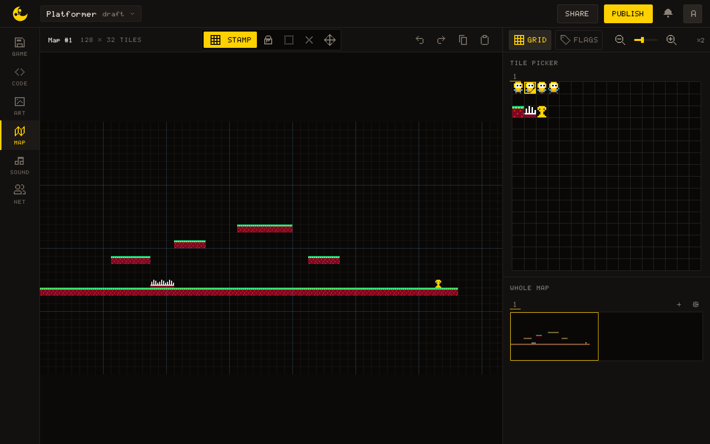
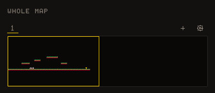
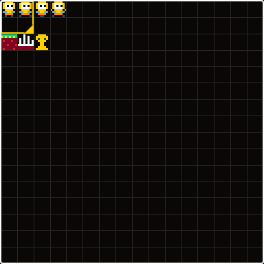
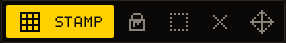

# MAP

The MAP tab is where you lay out levels and backgrounds: a grid of tiles, each holding the number of a sprite drawn in [ART](/learn/editors/art). Your code draws the grid with [[map.draw]] and reads it back with [[map.get]] and [[map.flag]]. This page is for whoever builds the level; the Lua side is at the end.



## The map

A new game has one map of **128 × 32 tiles**, and the header says so: `Map #1 128 × 32 TILES`. A tile is 8 × 8 pixels, the size of a sprite, so the map is 1024 × 256 pixels and the screen shows 20 × 11 tiles of it at a time. A tile holds a sprite number; sprite `0` is the empty tile.

The canvas in the middle is the map at `×2` by default. The zoom runs from `×1` to `×8`: the `−` and `+` buttons, the slider, or <kbd>Ctrl/⌘</kbd> + wheel over the map. The wheel on its own scrolls.

At the bottom left, a status line follows the pointer: `TILE 12,20 · SPR 017 · flags 0,2` is the tile under it, the sprite it holds and the bits set on that sprite, or `no flags`.

### Grid and Flags

Two toggles sit above the right panel. **Grid**, on by default, draws a fine line every tile and a heavier one every eight, which makes a screen easy to count out.

**Flags** tints every tile by the first flag set on its sprite, in the colour that bit has in the FLAGS panel of ART: bit 0 green, 1 blue, 2 orange, 3 pink, 4 hot pink, 5 gold, 6 lime, 7 magenta. It is the quickest way to see a level's collision: turn it on, and every solid tile lights up, every tile you forgot stays dark.

## The WHOLE MAP panel



The lower panel is a minimap of the current map, every tile drawn three pixels wide. The frame on it is what the canvas shows; **click or drag** on the minimap to jump there. The strip above it has a tab per map, a `+` and a gear, covered below.

## Painting



The TILE PICKER at the top of the right panel shows a sheet. Click a cell to make it the **brush**, the sprite the Stamp tool lays, or **drag a rectangle** of up to 8 × 8 cells to stamp a block of tiles at once: a whole tree, a platform end to end. The Tilesets strip above the picker chooses which sheet, since a map can take its tiles from any of them; a tileset is a sheet, as the ART tab calls it.



Five tools, each with a key. The letters are not those of ART: Select is <kbd>M</kbd> here, and <kbd>S</kbd> is Stamp.

| Tool   | Key          | What it does                                                    |
| ------ | ------------ | --------------------------------------------------------------- |
| Stamp  | <kbd>S</kbd> | Lays the brush at the pointer; a drag lays it along the way     |
| Fill   | <kbd>F</kbd> | Floods a patch of one tile with the brush's first cell          |
| Select | <kbd>M</kbd> | Drags a rectangle of tiles to transform, copy or move           |
| Erase  | <kbd>E</kbd> | Clears tiles to sprite 0                                        |
| Move   | <kbd>V</kbd> | Drags a floating paste into place                               |

Whatever the tool, the **right button erases**.

## Selection and clipboard

With Select, drag a rectangle of tiles. The transform bar at the top right of the canvas flips it horizontally or vertically and rotates it either way; the keys are <kbd>Shift</kbd>+<kbd>H</kbd>, <kbd>Shift</kbd>+<kbd>V</kbd>, <kbd>]</kbd> and <kbd>[</kbd>. <kbd>Delete</kbd> clears the selected tiles.

<kbd>Ctrl/⌘</kbd>+<kbd>C</kbd> and <kbd>Ctrl/⌘</kbd>+<kbd>X</kbd> copy and cut the selection; both need one, and the Copy button in the header stays grey until there is one. <kbd>Ctrl/⌘</kbd>+<kbd>V</kbd> pastes a **floating block** and switches to Move: drag it where it goes, then <kbd>Enter</kbd> settles it and <kbd>Esc</kbd> discards it.

### Undo

The two arrows in the header, <kbd>Ctrl/⌘</kbd>+<kbd>Z</kbd> and <kbd>Ctrl/⌘</kbd>+<kbd>Shift</kbd>+<kbd>Z</kbd> or <kbd>Ctrl/⌘</kbd>+<kbd>Y</kbd>. Adding, renaming and deleting a map are undone the same way.

## Map size

The gear of the WHOLE MAP strip opens the **Map size** dialog: a width and a height from 1 to 256 tiles. Tiles keep their place, so unlike a sheet nothing is renumbered and no code is rewritten. Shrinking does not delete either: the dialog counts the placed tiles that would fall outside, they stay in the file, and they come back if the map grows again. The button is called Shrink.

## Several maps

The `+` of the WHOLE MAP strip adds a map at the size of the current one. Double-click a tab, or click its pencil, to give the map a **name and a colour**; its cross deletes it after a confirmation. A deleted map takes its tiles with it, and code that drew it by number will draw the next map along, or nothing.

Every `map.*` function but [[map.flag]], which reads a sprite and not a map, takes the map it works on as its **last argument**, counted from `1` in the order of the strip. Leave it out and the first map is used, so a game with one map never names it.

``` lua
local level = 1

function _draw()
  gfx.clear(0)
  if level == 1 then
    map.draw(0, 0)
  else
    -- the whole of map 2: its size is needed to reach the last argument
    map.draw(0, 0, 0, 0, map.width(2), map.height(2), 2)
  end
end
```

## The map in Lua

[[map.draw]] draws the map with its top-left corner at a pixel position. With [[gfx.camera]] the same call scrolls through a level wider than the screen:

``` lua
local player = { x = 40, y = 40 }

function _draw()
  gfx.clear(0)
  gfx.camera(player.x - 160, 0)
  map.draw(0, 0)
  gfx.draw_sprite(0, player.x, player.y)
end
```

### Collision

The engine has no collision helpers. What it has is the map and the flags: mark the solid sprites with bit 0 in ART, then ask the map what is under a point. Tile coordinates are pixel coordinates divided by 8. Flags are read on the first sheet only, so a tile stamped from a second sheet has none, and `solid_at` below treats it as empty.

``` lua
local function solid_at(px, py)
  local tx = math.floor(px / 8)
  local ty = math.floor(py / 8)
  if tx < 0 or ty < 0 or tx >= map.width() or ty >= map.height() then
    return false
  end
  return map.flag(map.get(tx, ty), 0)
end
```

[[map.set]] changes a tile while the game runs, and [[map.get]] with a map number reads another map:

``` lua
map.set(12, 20, 0)             -- the coin at tile (12, 20) is gone
local spr = map.get(3, 4, 2)   -- what map 2 holds at tile (3, 4)
```

> [!IMPORTANT]
> A tile written with [[map.set]] lasts for the run. The next launch starts from the map as the MAP tab shows it.

Going the other way, a platform at tile column 9, row 20, five tiles wide, sits at `x = 72, y = 160, w = 40, h = 8` in pixels.
