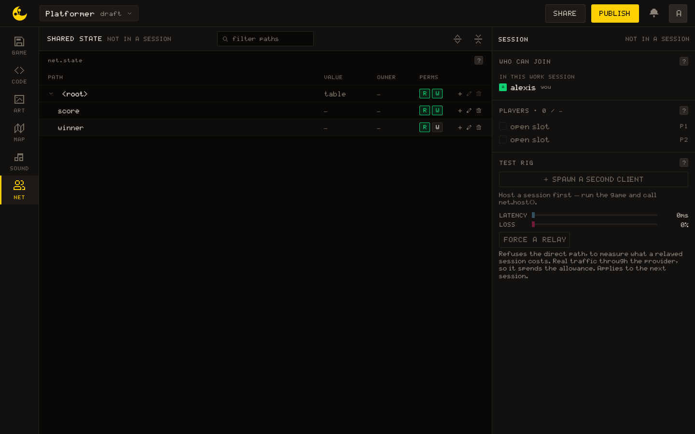
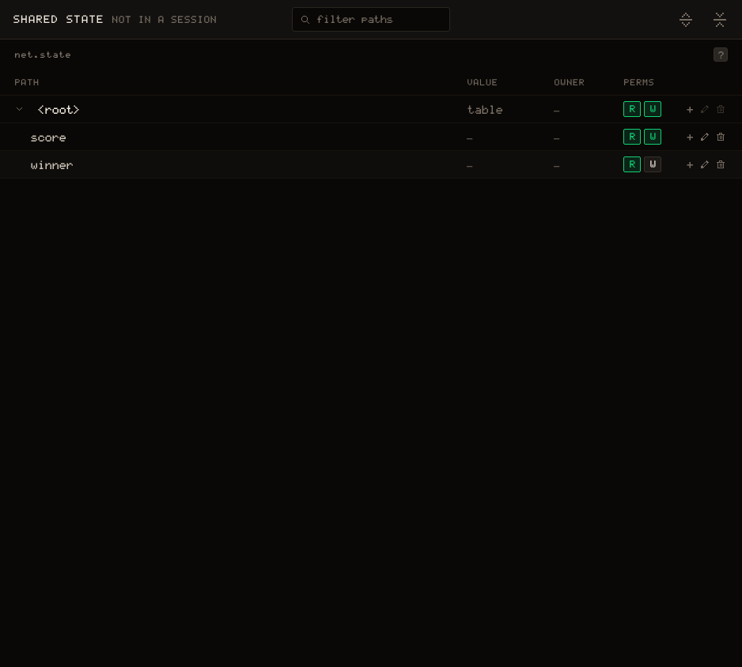
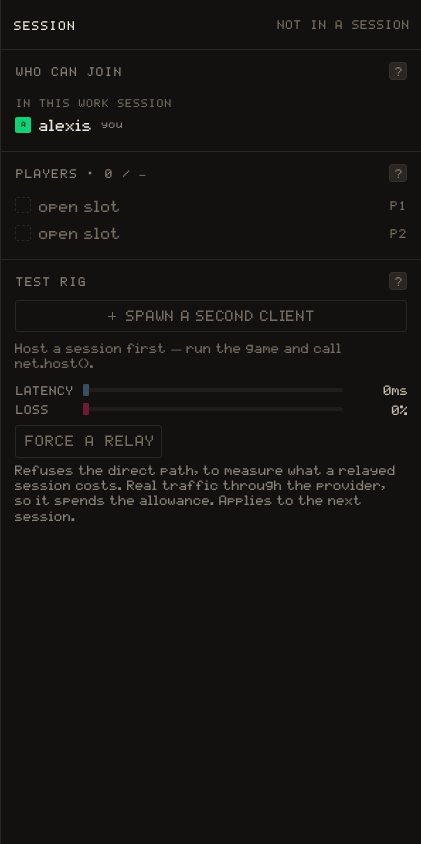
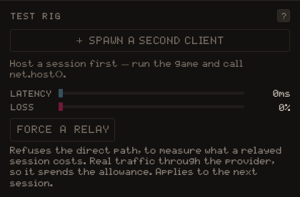

# NET

The NET tab is the window on a multiplayer game: the **shared state** it declares and what each path holds, the session it is running, who is in it, and a second client to play against yourself. The model behind it is on [Multiplayer](/learn/concepts/multiplayer); what the permissions are for is the [Permissions & authority](/learn/tutorials/permissions) tutorial.

## The layout

The workspace is the SHARED STATE table, and its head says whether the game is `live` in a session or `not in a session`. The panel on the right is the SESSION column, in three sections: WHO CAN JOIN, PLAYERS and TEST RIG.

### SHARED STATE

The table is every path the game declares under `net.state`, and, while a session runs, what it holds.

- **Path** is the tree, from `<root>` down, with a chevron to fold a branch. Filter paths in the head narrows it; Expand all and Collapse all open and close every branch.
- **Value** is a Lua literal, so a string keeps its quotes and an empty one is visible. A branch says how many entries it has. A path the game declared and no session has reached yet shows a dash: it has no value yet, which is not the same as `nil`.
- **Owner** is who holds the path in the running session: `host`, in gold, or a peer's name.
- **Perms** are the `R` and `W` toggles: whether joined clients may **read** and **write** the path. The host is never restricted. A path nothing was set on is open both ways.

The permissions live in the game, so they travel with it. Set a path up here before you run anything: with nothing declared the table offers **Declare a path**, and a dotted name such as `players.score` declares the whole branch at once. On a row, `+` is Add child node, the pencil renames the last segment, and the trash deletes the node with its children. While a session holds a path, only the host can change its shape.

### SESSION

The column's head says `hosting`, `joined` or `not in a session`.

WHO CAN JOIN lists the people in this work session first: everyone here can take a player slot, and a row says `in game · P1` once they have one. Anyone else needs the **code**, shown under the list with Copy while a session runs. The button under it is End session for the host and Leave session for a client; either way the game restarts.

PLAYERS is `Players · n / max`, where the maximum is what the game asked for in [[net.host]] with `max_players`, the host included. A filled row has the player's name, `host` on the host's, their ping in milliseconds and their seat, `P1`, `P2`; an empty one is an `open slot`. Under the seats, once anything has been sent, the **Route** line says whether the connection is `direct` or `relayed`, with the traffic so far and its rate per hour.

### TEST RIG

**Spawn a second client** opens a second copy of the game inside the panel, on this machine, that joins your session, so you can test netplay alone. It needs a session first: run the game and call `net.host()`. The panel says `Waiting for this client to call net.join()` until the second copy joins, then `Joined as a second player`. Close the second client takes it away.

Latency, 0 to 400 ms, and Loss, 0 to 30 %, are applied to that client's outgoing frames, not to yours. They are live while the rig is open.

> [!NOTE]
> The second client runs on your account. [[net.id]] is not a seat number, so it answers the same id in both windows; tell the two apart by their seat in PLAYERS.

**Force a relay** refuses the direct path, to measure what a relayed session costs. It sends real traffic through the provider, so it spends the allowance, and it applies to the next session, not the one running.
