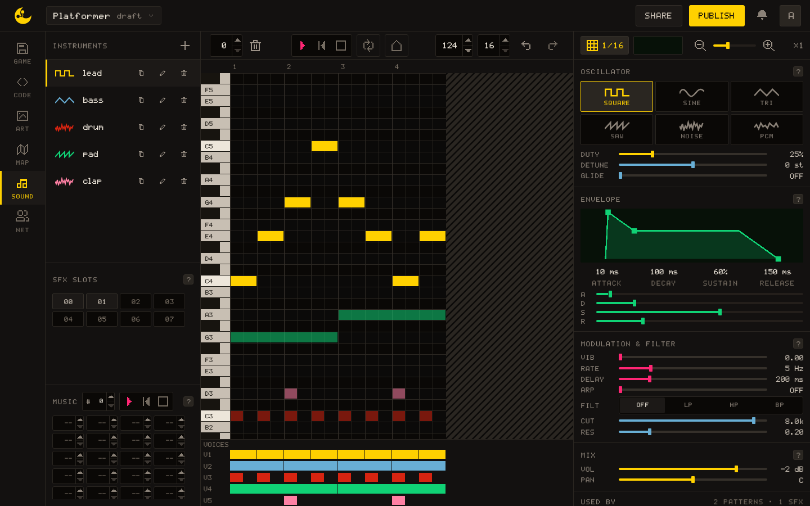
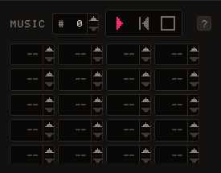
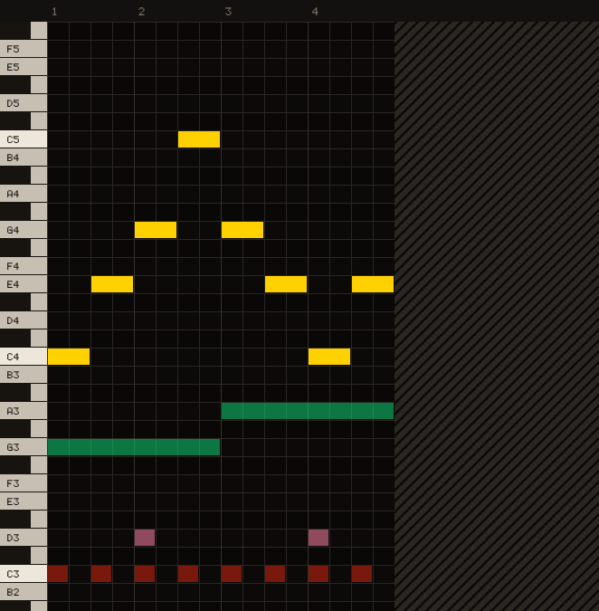
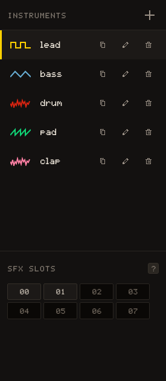
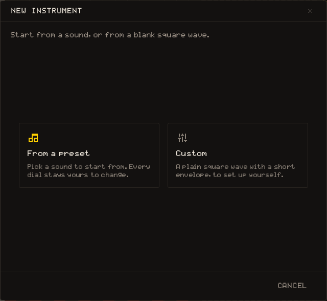
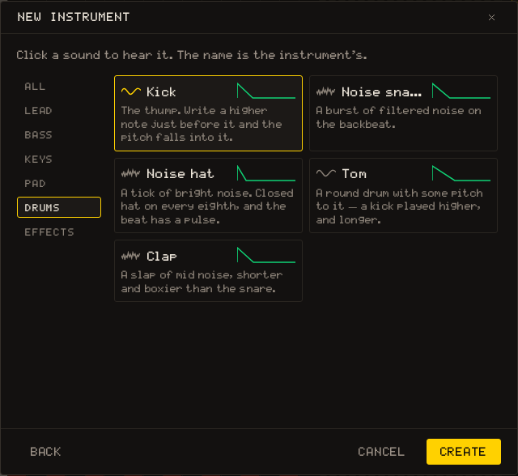
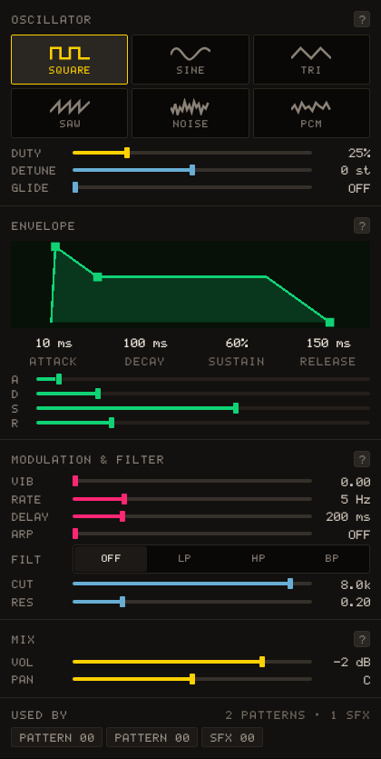

# Sound Editor

The Sound Editor allows you to compose music for your game using a built-in sequencer powered by Tone.js.



## Music slots

Projects include **16 music slots**. The buttons on the side of the Sound Editor switch between those slots so you can keep separate tracks for menus, levels, battles, or short jingles.



The editor labels slots as `1` through `16`. Lua uses zero-based indexes, so slot `1` is played with `sound.play_music(0)`, slot `2` with `sound.play_music(1)`, and so on.

## Sequencer grid

The grid has **24 note rows** and **32 columns**. Each column is a beat, and the current music plays at `240` BPM by default.



- Click an empty cell to add a one-beat note with the selected instrument.
- Click an existing note start to remove it.
- Drag across cells in the same row to create a longer note.
- Use **Play** and **Stop** to preview the current music.
- Use **Clear** to reset the current slot.
- Click the progress bar while playback is stopped to choose where the next preview starts.

## Instruments

The built-in instruments are **Piano**, **Guitar**, **Flute**, **Trumpet**, **Contrabass**, and **Harmonica**.



You can also create custom instruments. Custom instruments expose Tone.js synth parameters such as volume, detune, portamento, harmonicity, oscillator type, oscillator partials, and envelope settings. Custom instruments can be edited or deleted after creation.







## Using music in Lua

Use [[sound.play_music]] and [[sound.stop_music]] from your game code:

``` lua
function _init()
  sound.play_music(0)  -- plays Sound Editor slot 1
end

function _update()
  if input.key_pressed(" ") then
    sound.stop_music()
  end
end
```

See [sound](/learn/api/sound) for the Lua audio API reference.
