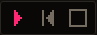
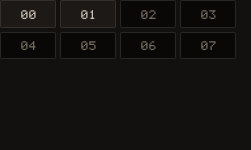
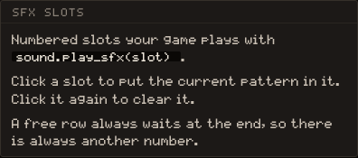

# SOUND

The SOUND tab is where you build instruments, write patterns on a piano roll, and chain those patterns into the musics and sound effects your game plays. Everything here goes through the console's own synthesizer: **five voices**, a handful of waves, and samples of about a second.


## The layout

The tab has three columns. On the left, **INSTRUMENTS** takes the room that is left above two fixed banks, SFX SLOTS and MUSIC. In the middle, a bar with the pattern number, the transport and the pattern's tempo and length sits over the piano roll, with the VOICES lane under it. On the right, the inspector shows every dial of the instrument in hand, and its head row holds the snap, an oscilloscope of the output, and the zoom.

A new game has no sound at all. The middle column says **No sound yet** and offers Add instrument; the roll appears once an instrument exists, because a note is placed with one.

### Instruments

The `+` at the head of INSTRUMENTS opens the **New instrument** dialog. It offers two starts: From a preset, or Custom, a plain square wave with a short envelope you set up yourself.


From a preset shows 23 sounds on shelves: All, Lead, Bass, Keys, Pad, Drums and Effects. A card **plays when it is clicked**, at the note the preset is written for, so a kick is heard as a kick. Create makes the instrument under the preset's name, and every dial of it stays yours to change.


The selected instrument, with the gold edge, is the one new notes are written with, and its colour paints its notes on the roll. Hover a row for three actions: Duplicate, the pencil, which opens **Rename instrument** (a name of up to 16 characters and one of the accent colours), and the trash.

> [!WARNING]
> The trash removes the instrument at once, with no confirmation. Its notes lose their instrument. Undo brings it back (<kbd>Ctrl/⌘</kbd>+<kbd>Z</kbd>).

### The inspector

The inspector is the instrument itself, in four blocks, and a fifth that says where it is used.


**OSCILLATOR** picks the raw wave: Square, Sine, Tri, Saw, Noise or PCM. Square adds a DUTY slider (5 % to 95 %). Noise ignores pitch. Under the wave, DETUNE shifts every note by up to 12 semitones either way, and GLIDE (0 to 500 ms) is the time the pitch takes to slide from one note to the next.

**ENVELOPE** is how loud the note is over its life. The graph has draggable handles: the peak moves attack and sustain at once, the next one decay, the last one release. The A, D, S and R sliders under it are the precise control, up to 3 s for each stage.

**MODULATION & FILTER**: VIB is the vibrato depth, RATE its speed (1 to 20 Hz) and DELAY how long the note waits before it starts wobbling. ARP walks a chord with a single voice, at 0 to 30 Hz; write several notes on the same step and the instrument plays them in turn. OFF holds them all at once. FILT picks Off, LP, HP or BP, with CUT and RES.

**MIX** is the instrument's own VOL and PAN. Every note it plays goes through them.

**Used by** counts the patterns and SFX slots that use the instrument, and names them.

### PCM samples

With PCM as the wave, the block gains **Import a sample**. Any audio file will do: it is mixed to mono and resampled to 8-bit at 8 kHz, and cut to the budget of 8 KB, which is about one second. The readout beside the button says what the sample costs, for instance `0.6 s · 4.8 KB`; Replace swaps it and the cross removes it.

ROOT is the note at which the sample plays at its recorded pitch, C4 by default. Every other note on the roll speeds it up or slows it down from there.

> [!IMPORTANT]
> A sample is bytes the game carries. Longer than the budget, the tail is cut, not compressed.

### The piano roll

Pitches run down the roll from **C1 to B6**, 72 of them, with a keyboard at the left; steps run across. The number field at the head of the bar is the PATTERN, from `00` to `99`. Every number is already a pattern, most of them empty: you go to one the way you turn a page, by typing its number or stepping with the arrows.


Each pattern keeps its own **BPM** (40 to 240, 124 by default) and its own **STEPS** (16 to 64 by bars of 16, 32 by default), at four steps to the beat. Shortening a pattern with notes past the new end asks first, **Shorten this pattern?**, because those notes go and it cannot be undone. A note that merely runs over the edge is trimmed rather than dropped.

The trash beside the PATTERN field is **Clear pattern NN**. It asks, then empties the pattern; anything that plays it, a music or a sound effect, keeps its place and falls silent.

Writing notes:

- Left click on an empty cell places a note of one snap unit with the selected instrument. Keep the button down and drag to the right, or to the left, and the note stretches from the cell it was put in.
- Left click on a note and drag to move it, in pitch and in time. Within a few pixels of either edge, the drag takes that edge instead, so a note stretches or shrinks from its start or its end.
- Right click deletes a note.
- A note placed, moved or grabbed sounds once, so you hear what you wrote.

**Snap**, in the inspector's head row, is the grid a note lands on: one press cycles Off, 1/4, 1/8, 1/16, 1/32 and back. The default is 1/16, one step. Off places freely, down to an eighth of a step. Zoom goes from ×0.5, where a 64-step pattern fits whole, to ×4; the two buttons double or halve it, and the `×N` readout sets it back to 1.

The keyboard at the left of the roll plays the selected instrument for as long as a key is held, and a drag across the keys is a glissando. It sounds on the fifth voice, so a pattern playing underneath keeps the others. The **VOICES** lane under the roll shows the five voices, each lit while it sounds, and the oscilloscope beside Snap draws the output.

### Transport



Play starts the pattern in front of you from wherever the head stands, and becomes Pause while it runs; Pause keeps the head where it was. **Back to the start** rewinds and Stop ends the take, so the head goes out. Loop repeats the pattern; Click is a metronome that ticks on every beat, louder on the downbeat, and never writes into the pattern.

The ruler at the top of the roll places the head: click it, or drag along it. This works during playback too. The take pauses for the length of the drag and picks up again where you let go.

> [!TIP]
> <kbd>Space</kbd> plays the pattern, or stops it if it is running.

### SFX SLOTS

The bank under the instruments is the sound effects the game plays with [[sound.play_sfx]]. **Click a slot to put the current pattern in it.** Click it again to clear it. A slot holding the pattern in front of you is drawn as current; a slot holding another pattern is filled; a free row always waits at the end, so there is always another number.





``` lua
function _update()
  if input.btnp("a") then
    sound.play_sfx(1) -- the pattern kept in slot 01
  end
end
```

A sound effect takes the first free voice of the five. When none is free it takes one from the music, oldest first, so the music keeps playing on the others.

### MUSIC

A music is a chain of patterns. The `#` field picks which of the **16 musics**, `0` to `15`, the grid shows; the game starts one with [[sound.play_music]] and the same number.


The grid is filled with pattern numbers, played left to right, then top to bottom. Each pattern keeps its own tempo and length, so a chain can change speed halfway. An empty box with music after it is a hole, drawn in **orange**: playing stops before it. Naming a pattern here is one of the ways an empty one becomes real.

The section has a transport of its own: Play the music, Back to the first pattern, Stop the music. The box that is sounding lights up in pink, and the head runs on the roll only while the roll shows the pattern that is sounding. Playing the music switches Loop off, since Loop belongs to the pattern above.

``` lua
function _init()
  sound.play_music(0)          -- music #0, loops by default
end

function _update()
  if input.btnp("b") then
    sound.stop_music(0.5)      -- fades out over half a second
  end
end
```

### Undo and redo

The two arrows at the right of the pattern bar, and <kbd>Ctrl/⌘</kbd>+<kbd>Z</kbd> / <kbd>Ctrl/⌘</kbd>+<kbd>Shift</kbd>+<kbd>Z</kbd>, undo and redo what happened to instruments, patterns and SFX slots, including a deleted instrument. **The MUSIC grid is not covered**: a box you emptied has to be typed back.

## Shortcuts

| Key | Does |
| --- | --- |
| <kbd>Space</kbd> | Play the pattern, or stop it |
| <kbd>Ctrl/⌘</kbd>+<kbd>Z</kbd> | Undo |
| <kbd>Ctrl/⌘</kbd>+<kbd>Shift</kbd>+<kbd>Z</kbd> | Redo |
| Right click on a note | Delete it |
| Drag on the ruler | Move the head, during playback too |

See [sound](/learn/api/sound) for the whole audio API, [[sound.play_note]] included, which plays an instrument from code without a pattern.
