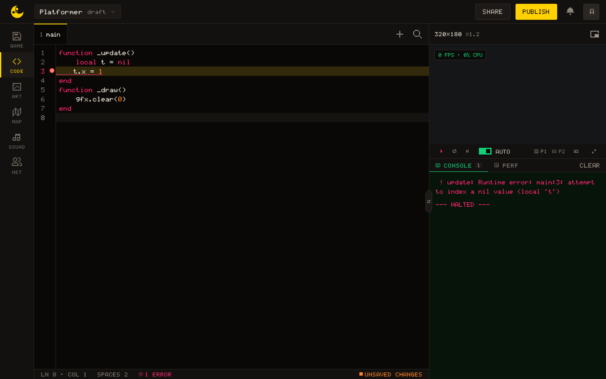

# Debugging Tips

This page is for the moment a game does something you did not write. It starts with the tools the editor gives you, then goes through the usual symptoms.

## The Console

The column beside the screen has a **Console** tab. It is emptied at every run, keeps the last 2000 lines, and prefixes each one: `> ` for a `print` or [[sys.log]], `? ` in orange for [[sys.warn]], `! ` in red for [[sys.error]] and for the engine's own errors. `print` and `sys.log` are the same function: arguments are separated by a tab, and a table is written out as JSON.


``` lua
local player = { x = 40, y = 40, vx = 0, on_ground = false }

function _update()
  player.x = player.x + player.vx
  if input.pressed("a") then print("pos:", player.x, player.y) end
  if input.pressed("b") then print(player) end   -- {"x":40,"y":40,"vx":0,"on_ground":false}
end
```

> [!TIP]
> A `print` in `_draw` writes sixty lines a second. To watch a value while playing, draw it with [[gfx.print]] in a corner of the screen instead.

The **Perf** tab beside it shows the measured FPS, the CPU share of the step, the frame count, the engine state, PLAYERS as `n / max` in a netplay session (`—` outside one), EDITORS, the number of people editing the project, and the sync state.

## What an error looks like

An error in `_init`, `_update` or `_draw` halts the game: the screen freezes on the last frame, the Console prints one red line followed by "--- HALTED ---", and the music stops. On the page of a published game, where there is no Console, the screen itself says the game stopped, shows that line and offers a Restart.

```
! update: Runtime error: main:12: attempt to index a nil value (global 'player')
--- HALTED ---
```

The line reads: the phase (`load`, `init`, `update` or `draw`), then the **tab** the error came from and the line number counted in that tab. The CODE tab highlights that line and its status bar shows "1 error". With the Auto switch on, the game reruns by itself once you fix the line, there is nothing to save; with it off, press Restart.



A syntax error is reported in the `load` phase before `_init` runs. The instruction budget (see [Limitations](/learn/reference/limitations)) halts the game the same way, with `execution aborted: possible infinite loop or recursion`.

The one exception: an error inside a `net` callback does not halt the game. It is only printed, as `Error: …`, so a multiplayer game that seems to ignore an event may be throwing in its handler.

## Nothing draws on screen

Check these first:

1. Is there a `_draw()` at all, spelled exactly that way?
2. Are the coordinates on screen, `0` to `319` for `x` and `0` to `179` for `y`? Remember that the camera persists: a [[gfx.camera]] left at a large offset from a previous frame moves everything off screen. `gfx.camera()` resets it.
3. Is the sprite drawn in colour `0`? It is the transparent colour of [[gfx.draw_sprite]], so a sprite painted in colour 0 on a colour 0 background is invisible.
4. Is it tile `0` on the map? Tile 0 is always drawn empty.
5. Is the game running? "--- HALTED ---" in the Console means it stopped. The game is also paused whenever its screen is not shown: while the browser tab is hidden, on every editor tab but CODE unless the VIEWER is popped out, and, popped out or not, while the REFERENCE has taken the console's place in a window narrower than 1602 px.

## Input does not work

The action functions [[input.held]] and [[input.pressed]] take an action name: `"left"`, `"right"`, `"up"`, `"down"`, `"a"`, `"b"`, `"x"`, `"y"`, `"pause"`. They answer to the arrows, WASD and ZQSD, a gamepad and the touch controls, which is why the tutorials use them. An action is not a key, and `"a"` is not the key A, which is `left`. The default keys for player 1:

| Action | Keys |
| --- | --- |
| `left` `right` `up` `down` | Arrow keys, <kbd>W</kbd><kbd>A</kbd><kbd>S</kbd><kbd>D</kbd>, <kbd>Z</kbd><kbd>Q</kbd><kbd>S</kbd><kbd>D</kbd> |
| `a` | <kbd>X</kbd> or <kbd>Space</kbd> |
| `b` | <kbd>C</kbd> or <kbd>Shift</kbd> |
| `x` | <kbd>V</kbd> |
| `y` | <kbd>B</kbd> |
| `pause` | <kbd>Esc</kbd> or <kbd>Enter</kbd> |

The player can change them in Settings › Controls; the whole table, with player 2 and the gamepad, is in [input](/learn/api/input#actions). And the screen has to have the keyboard: click it once before pressing a key.

[[input.key_pressed]] takes the browser's `event.key` name, which is **case-sensitive**: `"ArrowLeft"`, not `"arrowleft"`; `" "` for the space bar, not `"space"`; `"a"` for the key as typed. `"A"` matches only when the key produces an upper-case letter, with Shift held or Caps Lock on.

## Colors look wrong

A colour index is taken modulo 16 by every drawing function, [[gfx.clear]] and the shapes included: `17` draws colour `1`, and nothing warns you. If a shape shows up in a colour you never picked, check the arithmetic that produced the index.

If you used [[gfx.set_col]] to remap palette colours, call [[gfx.reset_col]] when the effect is done. The remap persists into every later draw call, in this frame and the next.

``` lua
-- Wrong: the swap leaks into everything drawn afterwards
gfx.set_col(8, 10)
gfx.draw_sprite(0, 40, 40)

-- Correct: reset after the effect
gfx.set_col(8, 10)
gfx.draw_sprite(0, 40, 40)
gfx.reset_col()
```

## The map reads as empty

[[map.get]] and [[map.flag]] return `0` outside the map, without an error: a collision test that reads past an edge sees empty tiles. Asking for a map number the game does not have returns `0` too, with one warning in the Console: `? map.get: this game has 1 map(s), there is no map 2`. Flags are read on the first sheet only, so a sprite from a second sheet always has flag `0`.
