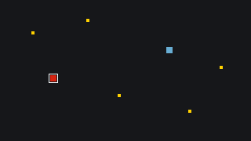
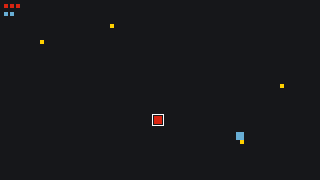

# Build a Coin Rush

Up to four players race to collect coins scattered on the screen; first to ten wins. When two players touch the same coin on the same frame, only one may get the point: this tutorial is all about [[net.lock]] (settling races fairly) and [[net.queue]] (feeding respawn work to the host). The game is called Coin Rush; its address, and the other tutorials, say `click-race`. Do the [Pong](/learn/tutorials/pong) tutorial first: this one builds on its session menu and moves faster over everything the two games share.

As in Pong, each step explains one idea and gives the functions that carry it, whole, so the game runs at the end of every step.

## What you will build

- A host/join menu for up to four players
- One coloured square per player, moved with the arrow keys
- Coins that only one player can collect, no matter how simultaneous the grab: each coin carries a lock in `net.state` (`net.lock`)
- A respawn work queue in `net.state`, processed by the host (`net.queue`)
- Per-player scores and a first-to-ten win

Everything is drawn with [[gfx.fill_rect]] and [[gfx.rect]]; no sprites needed. Copy to new game, at the head of this page, installs the finished game in a project of your own.

## Step 1: Reuse the session menu

Start from the state machine and menu you built in Pong (Steps 1 and 2 there): the same `"menu" | "waiting" | "playing" | "over"` dispatch, the same `update_menu` / `update_waiting` pair. Only the host call changes, with more seats and a different title, in both functions:

``` lua
function update_menu()
  if input.key_pressed("h") then
    state   = "waiting"
    is_host = true
    net.host({ max_players = 4, title = "Coin rush" }, on_connected)
  elseif input.key_pressed("j") then
    state   = "waiting"
    is_host = false
    net.join(on_connected)
  end
end
```

This game needs three extra locals next to `state` and `is_host`, all explained as they come up: `next_color` (host only), `respawn_timer` (host only), and `claiming` (a table, one entry per coin we are currently trying to grab). `_init()` resets all of them. The constants settle the field: `COIN_COUNT = 5`, `WIN_SCORE = 10`, `RESPAWN_DELAY = 120` (two seconds at 60 FPS), an 8-pixel player, a 4-pixel coin, and a `COLORS` list with **one palette colour per possible player**, four entries:

``` lua
W, H        = 320, 180
PLAYER_SIZE = 8
COIN_SIZE   = 4
SPEED       = 2
COIN_COUNT  = 5
WIN_SCORE   = 10
RESPAWN_DELAY = 120           -- frames (two seconds at 60 FPS)

COL_BG    = 0                 -- black
COL_COIN  = 4                 -- yellow
COL_RING  = 5                 -- white
COLORS    = { 2, 11, 13, 6 }  -- red, light blue, green, pink

state         = "menu"        -- "menu" | "waiting" | "playing" | "over"
is_host       = false
next_color    = 1             -- host only: next entry of COLORS to hand out
respawn_timer = 0             -- host only
claiming      = {}            -- coins we already have a pending lock request for

function _init()
  state      = "menu"
  is_host    = false
  next_color = 1
  respawn_timer = 0
  claiming   = {}
  print("Press H to host a game, J to join one")
end

function clamp(v, lo, hi)
  if v < lo then return lo end
  if v > hi then return hi end
  return v
end
```

The dispatch is Pong's, with one shortcut: `"over"` needs no function of its own, because all it does is wait for `m` to leave the session and restart. Give `update_playing()` an empty body and `on_connected()` a placeholder that prints, as in Pong's Step 2; Step 2 here replaces it:

``` lua
function _update()
  if state == "menu" then
    update_menu()
  elseif state == "waiting" then
    update_waiting()
  elseif state == "playing" then
    update_playing()
  elseif state == "over" and input.key_pressed("m") then
    net.leave()
    _init()
  end
end
```

## Step 2: The host provisions players

In Pong each player wrote its own paddle from the start. With four players and host-assigned colours it is cleaner to flip the pattern: **the host creates each player's entry** (spawn position, colour, score `0`), for itself at session start and for the others from `peer.joined`. A joiner simply waits until its entry appears, then starts moving it. Mid-game joins need no special code at all: the late joiner receives the full current state, and the host's `peer.joined` gives them a square like everyone else.

### Provisioning a player

The provisioning function is where the `net.state` empty-branch rule bites: a branch only exists once it holds a value, so the first player entry has to create the branch itself. The `next_color` counter hands out `COLORS` in turn, wrapping around with `next_color % #COLORS + 1`:

``` lua
function provision_player(playerId)
  local entry = {
    x     = math.random(8, W - 8 - PLAYER_SIZE),
    y     = math.random(8, H - 8 - PLAYER_SIZE),
    col   = COLORS[next_color],
    score = 0,
  }
  next_color = next_color % #COLORS + 1

  -- A net.state branch only exists once it holds a value, so the first
  -- player entry must create the branch itself
  if net.state.players then
    net.state.players[playerId] = entry
  else
    net.state.players = { [playerId] = entry }
  end
end
```

### Coins and the queue

A `new_coin()` helper returns one coin: a random position, `taken = false`, and its own `lock = net.lock()`. It is reused on respawn in Step 5:

``` lua
function new_coin()
  return {
    x     = math.random(8, W - 8 - COIN_SIZE),
    y     = math.random(8, H - 8 - COIN_SIZE),
    taken = false,
    lock  = net.lock(),   -- each coin guards itself; lives in net.state.coins[i]
  }
end
```

The host's part of `on_connected` then reads like a checklist: provision yourself, build a plain local table of `COIN_COUNT` coins and assign it to `net.state.coins` in one go, create the respawn queue with `net.state.respawns = net.queue()` (a queue lives in `net.state` just like the coins do), subscribe to `peer.joined` (provision them) and `peer.left` (delete `net.state.players[playerId]`). Both roles subscribe to `"ended"` (back to the menu through `_init()`) and switch to `"playing"`, as in Pong:

``` lua
function on_connected()
  if is_host then
    provision_player(net.id())

    local coins = {}
    for i = 1, COIN_COUNT do
      coins[i] = new_coin()
    end
    net.state.coins = coins

    net.state.respawns = net.queue()   -- shared work queue, host pops from it

    net.on("peer.joined", function(playerId)
      provision_player(playerId)
      print("Player " .. playerId .. " joined")
    end)

    net.on("peer.left", function(playerId)
      net.state.players[playerId] = nil
      print("Player " .. playerId .. " left")
    end)
  end

  net.on("ended", function()
    print("The host closed the session.")
    _init()
  end)

  state = "playing"
  print("Connected! Collect " .. WIN_SCORE .. " coins to win (arrow keys).")
end
```

> [!NOTE]
> Collected coins will be marked `taken` rather than deleted. Keeping all `COIN_COUNT` entries alive means the `coins` branch always exists and every index stays valid: one less `nil` case everywhere else in the game. Each coin's `lock` sits right beside the `taken` flag it protects.

## Step 3: Moving your square

Movement is Pong's paddle logic on two axes, applied to your own entry. The only new element is finding that entry, which **belongs to the host** until it has been provisioned:

``` lua
function my_player()
  local players = net.state.players
  if not players then
    return nil
  end
  return players[net.id()]
end
```

`update_movement()` returns if that is `nil` (not provisioned yet, the multi-player version of Pong's replication-lag guard), then moves `me.x` / `me.y` with the arrow keys and clamps both to the screen. Call it from `update_playing()`:

``` lua
function update_movement()
  local me = my_player()
  if not me then
    return   -- the host has not provisioned us yet
  end

  if input.key_pressed("ArrowLeft")  then me.x = me.x - SPEED end
  if input.key_pressed("ArrowRight") then me.x = me.x + SPEED end
  if input.key_pressed("ArrowUp")    then me.y = me.y - SPEED end
  if input.key_pressed("ArrowDown")  then me.y = me.y + SPEED end

  me.x = clamp(me.x, 0, W - PLAYER_SIZE)
  me.y = clamp(me.y, 0, H - PLAYER_SIZE)
end

function update_playing()
  update_movement()
end
```

For drawing, iterate the players. `pairs` over a `net.state` branch yields **string** keys, so convert before comparing ids. Each square gets a white ring when it is yours, and a row of small squares in its colour at the top left, one per point, which stays empty until Step 4. The untaken coins are drawn the same way, skipping entries with `taken` set:

``` lua
function draw_players()
  local row = 0
  for id, p in pairs(net.state.players or {}) do
    gfx.fill_rect(p.x, p.y, PLAYER_SIZE, PLAYER_SIZE, p.col)

    if tonumber(id) == net.id() then
      gfx.rect(p.x - 2, p.y - 2, PLAYER_SIZE + 4, PLAYER_SIZE + 4, COL_RING)   -- highlight yourself
    end

    for i = 1, p.score do
      gfx.fill_rect(4 + (i - 1) * 6, 4 + row * 8, 4, 4, p.col)
    end
    row = row + 1
  end
end

function draw_coins()
  local coins = net.state.coins
  if not coins then
    return
  end

  for i = 1, COIN_COUNT do
    local coin = coins[i]
    if coin and not coin.taken then
      gfx.fill_rect(coin.x, coin.y, COIN_SIZE, COIN_SIZE, COL_COIN)
    end
  end
end

function _draw()
  gfx.clear(COL_BG)

  if state == "playing" or state == "over" then
    draw_coins()
    draw_players()
  else
    -- Menu / waiting: show one square per possible player
    for i = 1, #COLORS do
      gfx.fill_rect(60 * i + 20, (H - PLAYER_SIZE) / 2, PLAYER_SIZE, PLAYER_SIZE, COLORS[i])
    end
  end
end
```

### One account per player

This game keys everything by `net.id()`, so every client needs an id of its own. The NET tab's Test rig gives its second client one: it runs on your account, but the host's `peer.joined` sees a new id, provisions a second entry, and each screen steers **its own square**. Set it up as in Pong ([Testing with two clients](/learn/tutorials/pong#testing-with-two-clients)): viewer popped out, Auto off, then click the rig's screen and press `j` there. To go past two players, add a second browser logged in to another account, or friends.

> [!TRY]
> Host plus one or two joiners: every screen should show every square moving live, each with a white ring around its own. Join a third player after moving around a bit: the newcomer sees everyone in the right place. That is the state snapshot at work.



## Step 4: Coins behind a lock

Here is the race this game exists for: two players overlap coin `3` on the same frame and both try to take it. Both read `taken == false`, both would mark it, both would score and both would ask for a respawn. The coin's own lock, `net.state.coins[i].lock` from Step 2, orders the two claims: the host grants **one request at a time**, so whatever runs inside `acquire` runs after the previous holder has released.

``` lua
function try_collect(i)
  if claiming[i] then
    return   -- we already have a pending request for this coin
  end
  claiming[i] = true

  net.state.coins[i].lock.acquire(function(release)
    claiming[i] = false

    local coin = net.state.coins[i]
    if not coin.taken then             -- still there: it is ours
      coin.taken = true
      local me = my_player()
      me.score = me.score + 1
      net.state.respawns.push(i)       -- ask the host for a replacement

      if me.score >= WIN_SCORE then
        net.state.winner = net.id()
      end
    end

    release()
  end)
end
```

### Why every line is there

- The `claiming` guard stops `_update` from piling up a new lock request every frame while you stand on a coin.
- The `taken` re-check inside `acquire` is the whole point of the lock: the world may have changed between asking for the lock and being granted it. The loser of the race reaches this line and finds the coin already gone.
- `release()` runs on every path: a lock that is never released blocks that coin for the rest of the session.

Drive it from an `update_collect()` that loops over the coins and calls `try_collect(i)` for any untaken coin overlapping you. The overlap test is the AABB rectangle test from [limitations](/learn/reference/limitations), with the player and coin sizes. Then add `update_collect()` to `update_playing()`:

``` lua
function overlaps_coin(me, coin)
  return me.x < coin.x + COIN_SIZE and me.x + PLAYER_SIZE > coin.x
     and me.y < coin.y + COIN_SIZE and me.y + PLAYER_SIZE > coin.y
end
```

``` lua
function update_collect()
  local me    = my_player()
  local coins = net.state.coins
  if not me or not coins then
    return
  end

  for i = 1, COIN_COUNT do
    local coin = coins[i]
    if coin and not coin.taken and overlaps_coin(me, coin) then
      try_collect(i)
    end
  end
end

function update_playing()
  update_movement()
  update_collect()
end
```

## Step 5: Respawns from a queue

Collectors push the coin's index onto the `net.state.respawns` queue (already done in Step 4); the host pops one every couple of seconds and refreshes that coin. A queue fits perfectly: pushes from all players line up in order, each index is delivered to **exactly one popper**, and popping an empty queue just hands the callback `nil`. The `respawn_timer` counts up to `RESPAWN_DELAY` between pops:

``` lua
function update_respawns()
  respawn_timer = respawn_timer + 1
  if respawn_timer < RESPAWN_DELAY then
    return
  end
  respawn_timer = 0

  net.state.respawns.pop(function(i)
    if i and not net.state.winner then
      net.state.coins[i] = new_coin()
    end
  end)
end
```

Only the host calls it: it goes in `update_playing()` inside an `is_host` branch, next to `update_movement()` and `update_collect()` which everyone runs. Close the loop like in Pong: when `net.state.winner` appears, announce it and switch to `"over"`, where `m` calls `net.leave()` and restarts:

``` lua
function update_playing()
  update_movement()
  update_collect()

  if is_host then
    update_respawns()
  end

  if net.state.winner then
    state = "over"
    if net.state.winner == net.id() then
      print("You win! Press M for the menu.")
    else
      print("Player " .. net.state.winner .. " wins. Press M for the menu.")
    end
  end
end
```

> [!TRY]
> Park two players on the same coin. The coin disappears, one of the two scores, and the other finds it taken; two seconds later a fresh coin appears elsewhere. The lock does not decide who wins the coin, it decides that the claims run one after the other, and the re-check inside is what makes that order count.



## How it all fits together

{{svg:img/click-race-roles.svg}}

## Extending the example

- Bonus coins: store a `value` on each coin and add it to the score.
- Sudden death: the host shortens `RESPAWN_DELAY` as scores climb.
- Announcements: `net.emit("stolen", i)` when you snatch a coin someone was standing on.
- Round timer: the host counts frames down in `net.state.time_left`; highest score wins at zero.
