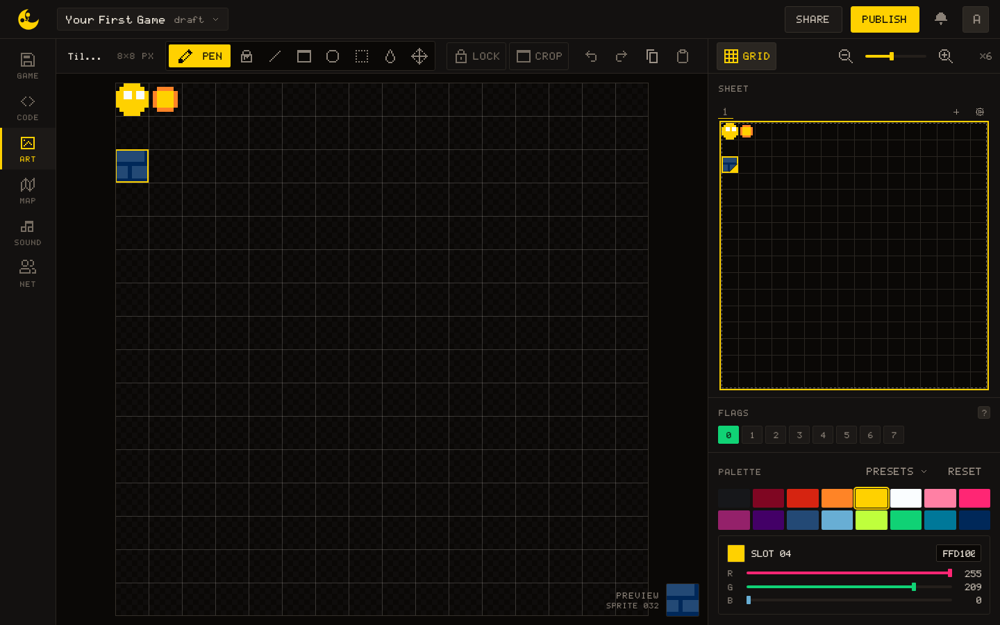
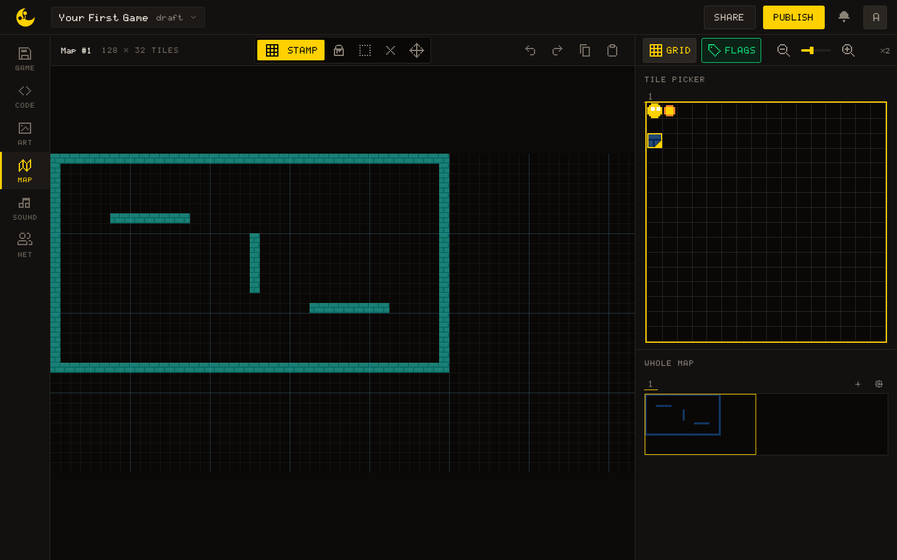
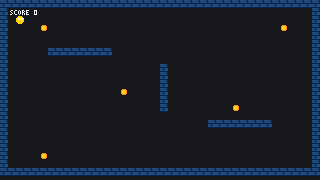

# Your First Game

This tutorial turns the sprite you moved in [Getting started](/learn/getting-started) into a game you can finish: a room with walls, five coins to collect, a score and a win. It takes about ten minutes and visits ART, MAP and CODE once each.

Each step explains one idea and shows only the lines that carry it. If you get stuck, the [complete code](#complete-code) is at the foot of the page, and **Copy to new game** at its head installs the code, the sprites, the flag and the map together, so the copy runs as-is.

## What you will build

A top-down room that fits on one screen. The player walks in four directions and stops at the walls; each coin disappears when touched and counts one point; when the fifth is taken, the game says so.

## Step 1: Draw the sprites

Open **ART**. The number under the preview, such as `SPRITE 032`, tells you which sprite is selected.

### The player and the coin

Draw the player in sprite `0`: a round body in colour `4` (yellow) with two eyes in colour `5` (white). Draw the coin in sprite `1`: a small disc in colour `4` with a rim in colour `3` (orange), leaving a one-pixel margin all round so it looks smaller than the player.

A new game does not start empty: the starter moon sits in sprites `1`, `2`, `17` and `18`. Drawing the coin over `1` is intended; clear the other three if you like, this game never draws them.

### The wall and its flag

Draw a brick tile in sprite `32`: bricks in colour `10` (navy) with mortar lines in colour `15` (dark blue). The tile repeats on the map, so keep the lines at its edges.

With sprite `32` selected, find the **FLAGS** panel under the sprite: eight buttons numbered `0` to `7`. Turn on button `0`. The engine never reads flags itself; Step 3 reads bit `0` with [[map.flag]] and decides that it means "solid".



## Step 2: Paint the room

Open **MAP**. Pick sprite `32` in the TILE PICKER, choose the Stamp tool and paint:

- a border: row `0`, row `21`, column `0` and column `39`, all the way across
- a few inner walls, for instance row `6` from column `6` to `13`, row `15` from column `26` to `33`, and column `20` from row `8` to `13`

The screen is `320 x 180` pixels, which is `40` tiles across and `22` and a half down. The map is bigger than that (`128 x 32` tiles), but the game never moves the camera, so **only the top-left `40 x 22` tiles are ever on screen**: keep everything inside rows `0` to `21` and columns `0` to `39`.

> [!TIP]
> The **Flags** button of MAP tints every tile by the first flag set on its sprite. Switch it on: every wall should light up. A wall with no tint was painted with the wrong sprite, and the player will walk through it.



## Step 3: Walk into walls

Switch to **CODE**, delete the starter script, and start with the numbers Step 1 and 2 decided:

``` lua
SPRITE_PLAYER = 0
SPRITE_COIN   = 1
SPRITE_WALL   = 32
FLAG_SOLID    = 0

TILE_SIZE = 8
SPEED     = 2
```

### Which tiles are solid

There is no separate collision data: the painted map is the collision data. One function answers the only question the walls ever get asked, is the pixel at `(px, py)` inside a solid tile? Divide by the tile size to get a tile coordinate, read the sprite painted there with [[map.get]], and ask its flag with [[map.flag]]:

``` lua
function solid_at(px, py)
  local tx = math.floor(px / TILE_SIZE)
  local ty = math.floor(py / TILE_SIZE)
  return map.flag(map.get(tx, ty), FLAG_SOLID)
end
```

The player is `8 x 8` pixels, so it can stand at `(x, y)` when none of its four corners is inside a wall. The right and bottom corners are at `+ 7`, not `+ 8`: an 8-pixel body covers pixels `x` to `x + 7`, and testing one further would read the tile next door.

``` lua
function can_stand(x, y)
  return not solid_at(x, y)
     and not solid_at(x + 7, y)
     and not solid_at(x, y + 7)
     and not solid_at(x + 7, y + 7)
end
```

> [!NOTE]
> [[map.get]] outside the map answers `0`, and sprite `0` is the player, which carries no flag, so the edges of the map read as empty. The border you painted is what keeps the player in. Give sprite `0` a flag some day and the [platformer](/learn/tutorials/platformer) shows the bounds guard you then need.

### Move, then check

`_init` creates the player where Getting started did, only closer to the corner. `_update` reads the four directions with [[input.held]] into a step `dx, dy`, then applies each axis only if the player can stand there. Testing the two axes **separately** is what lets the player slide along a wall instead of sticking to it:

``` lua
  local dx, dy = 0, 0
  if input.held("left")  then dx = -SPEED end
  if input.held("right") then dx = SPEED end
  if input.held("up")    then dy = -SPEED end
  if input.held("down")  then dy = SPEED end

  if can_stand(player.x + dx, player.y) then
    player.x = player.x + dx
  end
  if can_stand(player.x, player.y + dy) then
    player.y = player.y + dy
  end
```

`_draw` clears the screen, draws the map with [[map.draw]] at the origin, then the player on top:

``` lua
  gfx.clear(0)
  map.draw(0, 0)
```

> [!NOTE]
> Try it
>
> Run the game. The player walks around the room and stops flush against every wall, inner walls included. If it walks through one, check Step 1: the flag is on the sprite, not on the map.



## Step 4: Coins and a score

A coin is a small table: where it is, and whether it has been taken. Five of them go in a list in `_init`, beside a `score` that starts at `0`:

``` lua
  coins  = {
    { x = 40,  y = 24,  taken = false },
    { x = 280, y = 24,  taken = false },
    { x = 120, y = 88,  taken = false },
    { x = 232, y = 104, taken = false },
    { x = 40,  y = 152, taken = false },
  }
```

### Touching a coin

Two `8 x 8` boxes overlap when each one starts before the other one ends, on both axes. That is the whole test, and it works for any two things with an `x` and a `y`:

``` lua
function overlaps(a, b)
  return a.x < b.x + 8 and b.x < a.x + 8
     and a.y < b.y + 8 and b.y < a.y + 8
end
```

`collect_coins` walks the list and takes every coin the player touches. The `taken` flag is what stops a coin from **scoring twice**; the coin itself stays in the list:

``` lua
function collect_coins()
  for _, coin in ipairs(coins) do
    if not coin.taken and overlaps(player, coin) then
      coin.taken = true
      score = score + 1
    end
  end
end
```

Call it at the end of `_update`, after the player has moved.

### Drawing them

In `_draw`, draw the coins that are still there, between the map and the player, then the score with [[gfx.print]]. A number joins a string with `..`, and the last argument is the colour, `5` for white:

``` lua
  for _, coin in ipairs(coins) do
    if not coin.taken then
      gfx.draw_sprite(SPRITE_COIN, coin.x, coin.y)
    end
  end
  gfx.draw_sprite(SPRITE_PLAYER, player.x, player.y)

  gfx.print("SCORE " .. score, 10, 10, 5)
```

> [!NOTE]
> Try it
>
> Walk over a coin: it vanishes and the score goes up by one. Walk back over the spot: nothing happens.

## Step 5: Win

The game is won when the score reaches the number of coins, which `#coins` gives without counting. Add a `won = false` to `_init`, and at the end of `_update`:

``` lua
  if score == #coins then
    won = true
  end
```

Then make it the first thing `_update` checks, so the player freezes where it stands:

``` lua
  if won then
    return
  end
```

`_draw` keeps running and adds the message. Every glyph of the built-in font is `4` pixels wide, so `#text * 4` is the width of the text and the subtraction centres it on the `320` pixel screen:

``` lua
  if won then
    local text = "YOU WIN"
    gfx.print(text, (320 - #text * 4) // 2, 84, 4)
  end
```

> [!NOTE]
> Try it
>
> Take all five coins. The score reads `SCORE 5`, the player stops, and `YOU WIN` appears in the middle of the room.

## Complete code

{{lua:main.lua}}

## Extending the example

- A timer: count frames in `_update` and print `frames // 60` beside the score.
- A second room: paint it to the right of the first and move the camera with [[gfx.camera]] once the player reaches the door.
- A chasing enemy: a table like a coin that moves one pixel towards the player each frame, and ends the game on `overlaps`.
- Then the [platformer](/learn/tutorials/platformer): the same map-as-collision idea with gravity, jumping and a camera.
