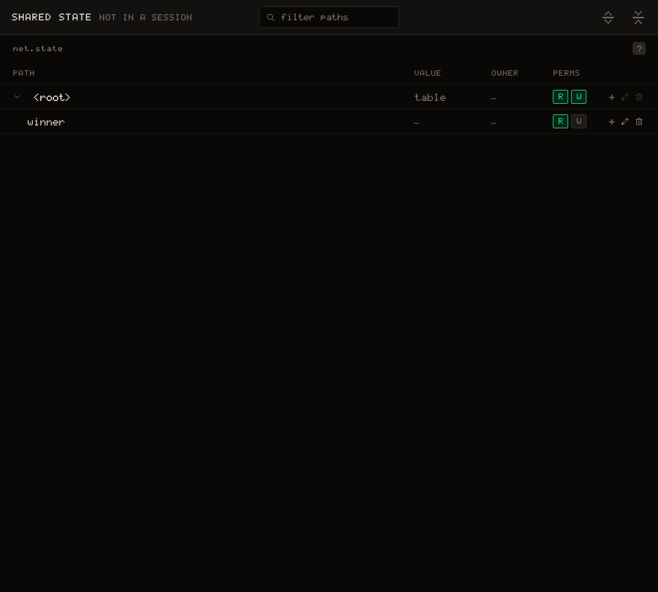

# Permissions & authority

By default `net.state` trusts every client: any peer can write any key, and games stay honest by [ownership convention](/learn/concepts/multiplayer). That is fine for a friendly game, but a determined client could just do `net.state.winner = net.id()` and win. This tutorial turns that convention into a rule the **host enforces**, using the NET tab.

We build on the [Coin Rush](/learn/tutorials/click-race) game (`click-race`); have it working first.

## The two flags

Every `net.state` path has two client permissions, set in the NET tab's SHARED STATE table and enforced by the host at runtime. They are the two dots of the **PERMS** column, `R` then `W`; their tooltips say "Clients can read this path" and "Clients can write this path".

- W off: only the host may write the path. A client's write is applied optimistically and then rolled back when the host's rejection arrives, so a `net.on` change listener sees the value flip and flip back.
- R off: the host keeps the path private. It is never sent to clients, neither in the join snapshot nor in live updates.

Three things to keep in mind:

- Allow by default. A path you never configure is fully open. You opt into restrictions; you never have to grant permissions just to keep a game working.
- Inheritance. A path inherits the flags of its nearest configured ancestor, so locking `players` locks `players.3.x` too; configure at the granularity you actually own.
- The host is the authority. There is no separate server to restrict, and "client" always means a joined peer. The host itself is never restricted.

## Make the winner host-authoritative

In Coin Rush, the client that reaches `WIN_SCORE` sets the winner itself, inside `try_collect`, right after it pushes the respawn: `if me.score >= WIN_SCORE then net.state.winner = net.id() end`. Delete those three lines. The result is a global fact, so the **host** should decide it, and the function that collects a coin only collects it:

``` lua
function try_collect(i)
  if claiming[i] then
    return   -- we already have a pending request for this coin
  end
  claiming[i] = true

  net.state.coins[i].lock.acquire(function(release)
    claiming[i] = false

    local coin = net.state.coins[i]
    if not coin.taken then             -- still there: it is ours
      coin.taken = true
      local me = my_player()
      me.score = me.score + 1
      net.state.respawns.push(i)       -- ask the host for a replacement
    end

    release()
  end)
end
```

Add a host check and call it from the game loop:

``` lua
function check_winner()
  if net.state.winner then
    return
  end
  for id, p in pairs(net.state.players or {}) do
    if p.score >= WIN_SCORE then
      net.state.winner = tonumber(id)
      return
    end
  end
end

function update_playing()
  update_movement()
  update_collect()

  if is_host then
    update_respawns()
    check_winner()          -- the host is the referee
  end

  if net.state.winner then
    state = "over"
    if net.state.winner == net.id() then
      print("You win! Press M for the menu.")
    else
      print("Player " .. net.state.winner .. " wins. Press M for the menu.")
    end
  end
end
```

### Lock the key

In the NET tab, click **Declare a path** and enter `winner` (once a path is declared, the `+` on its row, Add child node, does the same). Switch off its `W` and leave `R` on: everyone still needs to see who won. You can do this before running anything; the flags live in the game, not in the session. Run and host, and the game plays exactly as before, because only the host writes `winner` now.

### See the rule bite



Temporarily add `net.state.winner = net.id()` to a client path (say, on a key press) and press it from a joined client; the Test rig's second client is one, so its screen is where to press. On every other screen nothing happens: the host rejects the write and it never reaches them. On the cheater's own screen the write is applied for a moment, so `update_playing` sees `net.state.winner`, switches to `"over"` and prints "You win!"; then the rejection snaps `winner` back to `nil`, and a `net.on("winner", ...)` listener sees it flip and flip back. The permission rolls back the **value**, not the game's own state machine: the cheater's game stays on its "over" screen, alone.

> [!NOTE]
> A client's writes leave in batches: the writes made since the last `emit`, lock or queue call of the step leave together, and a batch the host refuses is refused as a whole, so a forbidden write never lands partially, and neither do the allowed writes that left with it. In practice clients only write their own open keys, so this rarely comes up.

## Keeping state host-private

Turning R off keeps a path on the host only. Use it for anything a client should not be able to inspect: a shuffled deck, an AI's target, an unrevealed answer. A host-only dealing function, with `make_deck` and `shuffle` left for you to write:

``` lua
function deal()
  net.state.deck = shuffle(make_deck())    -- with R off on "deck",
                                           -- clients never receive it
  net.state.top_card = net.state.deck[1]   -- reveal one card through a readable key
end
```

Clients simply never have `net.state.deck` in their store; reading it returns `nil`. The host reveals what it wants through **separate, readable keys**.

## What to lock down

A good rule of thumb: the host owns anything global or authoritative, such as the winner or whose turn it is, and clients own only their own id-keyed branch (their position, their inputs, their own score). Mark the global keys host-only and you have turned the ownership convention into something the **engine guarantees**.

Note the distinction: in Coin Rush each player's score lives inside its own id-keyed branch (`net.state.players[net.id()].score`) and is written by that client, so it stays open; it is the winner derived from those scores that is global and belongs to the host. Lock the authoritative fact, not the per-player data that feeds it.

> [!WARNING]
> A lock obeys the write permission of the path it lives at: a client that cannot write a path cannot acquire a lock under it, and the acquire fails with `net.on("error")` firing `"forbidden"` for that path, its callback never running. In Coin Rush the clients mark `coins[i].taken` and acquire `coins[i].lock` themselves, so `coins` must stay writable. Switch `W` off on it and every `try_collect` fails, so a game that tracks pending claims the way Coin Rush does should clear `claiming[i]` in its `net.on("error")` handler, or that coin stays claimed on the refused screen forever. Spawned pickups belong to the host only when the host also does the picking up.
