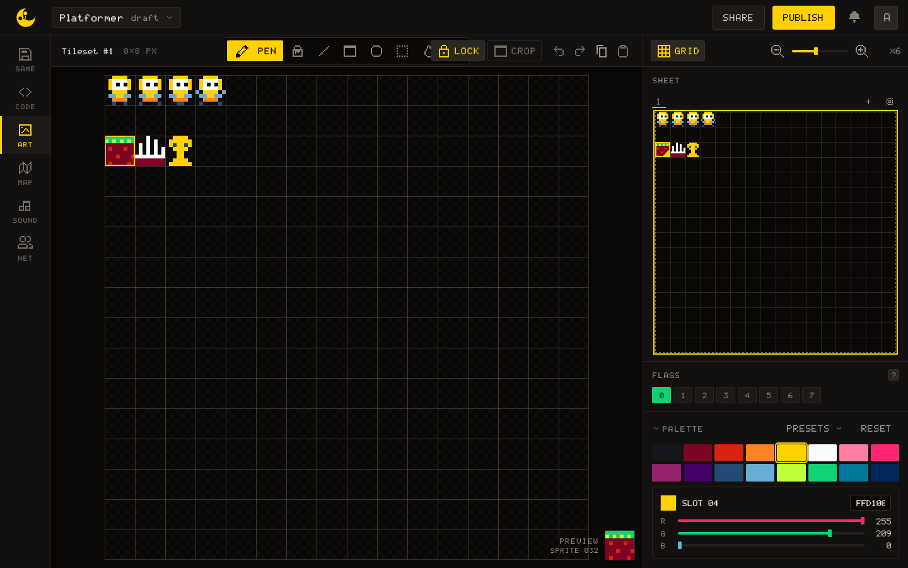
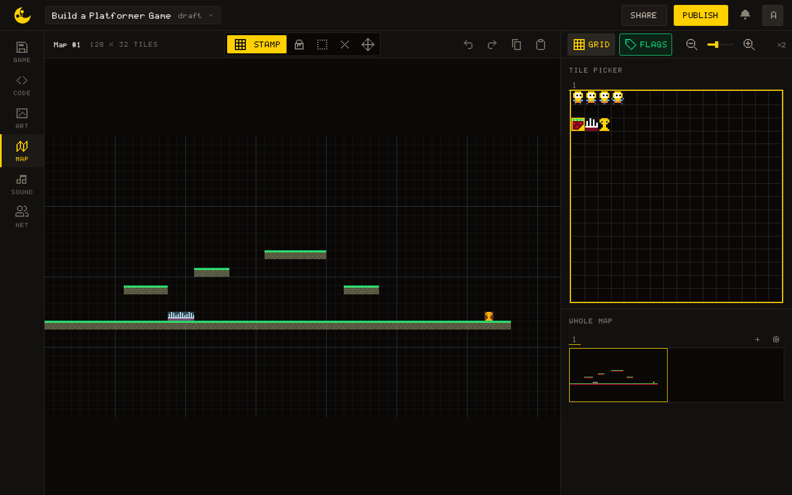

# Build a Platformer Game

This tutorial walks you through building a complete platformer with animated sprites, gravity, jumping, platform collision, and camera scrolling. It is the first big one, after [Your First Game](/learn/tutorials/first-game): it visits ART, MAP and CODE in turn and needs no second player.

Rather than handing you the finished script, each step explains one idea and shows only the lines that carry it; you write the rest. If you get stuck or want to check your work, the [complete code](#complete-code) is one click away, and **Copy to new game** at the head of the page installs the code, the sprites, their flags and the map together, so the copy runs as-is.

## What you will build

A side-scrolling platformer where the player can:

- Move left and right
- Jump between platforms
- Fall with gravity
- Respawn when falling off the screen
- Respawn when touching deadly tiles
- Win when touching the end tile

The camera follows the player horizontally.

## Step 1: Prepare your sprites

### Draw the seven sprites

Open **ART** and draw these sprites. The number under the preview, such as `SPRITE 032`, tells you which one is selected.

| Sprite index | Content                            |
|--------------|------------------------------------|
| `0`          | Player standing (idle)             |
| `1`          | Player walking frame 1             |
| `2`          | Player walking frame 2             |
| `3`          | Player jumping                     |
| `32`         | Solid ground/platform tile         |
| `33`         | Deadly tile, such as spikes        |
| `34`         | End tile, such as a trophy or door |

The player character is **8 pixels wide and 8 pixels tall** (1 tile wide, 1 tile tall). Each player animation frame fits in a single sprite slot.



A new game does not start empty: the starter moon sits in sprites `1`, `2`, `17` and `18`, and the starter script in CODE moves it around. Drawing the walk frames over `1` and `2` is intended; clear `17` and `18` too if you like (this game never draws them). The starter script goes as well: Step 3 replaces it from the first line.

### Set the flags

Under the sprite, the **FLAGS** panel shows eight buttons numbered `0` to `7`. Select each tile sprite and turn on one of them:

- sprite `32` (solid): button `0`
- sprite `33` (deadly): button `1`
- sprite `34` (end): button `2`

The engine ignores flags; your code reads them in Step 3 with [[map.flag]], and what each bit means is your decision.


> [!TIP]
> You can use any sprite indexes you want. Just update the constants at the top of the script to match and enable the same flag bits on the matching tile sprites.

## Step 2: Paint your level

Open **MAP**. Pick a tile in the TILE PICKER, then paint it with the Stamp tool:

- a ground row: a full row of solid tiles across the bottom
- floating platforms: smaller groups of tiles at different heights
- deadly tiles: a few spikes or hazards that send the player back to the start
- an end tile: the tile the player touches to win

Example layout (each cell = 8 pixels):

```
Row 17 (y=136): platform at columns 9-13
Row 15 (y=120): platform at columns 17-20
Row 13 (y=104): platform at columns 25-31
Row 17 (y=136): platform at columns 34-37
Row 20 (y=160): deadly tiles at columns 14-16
Row 20 (y=160): end tile at column 50
Row 21 (y=168): ground spanning columns 0-52
```

> [!TIP]
> The **Flags** button of MAP tints every tile by the first flag set on its sprite. Switch it on to check Step 1 at a glance: the ground and platforms in one colour, the spikes in another, the end tile in a third. A tile with no tint carries no flag, and the player will fall through it.



## Step 3: Read the map as collision

There is no separate collision data in this game: the painted map is the collision data. Switch to **CODE**, delete the starter script, and start with constants for everything Step 1 and 2 decided: the four player sprite indexes, the player size (`8 x 8`), `TILE_SIZE = 8`, the map size (`MAP_W, MAP_H = 128, 32`, the default), `SPRITE_COUNT = 256`, and one constant per flag bit (`FLAG_SOLID = 0`, `FLAG_KILL = 1`, `FLAG_END = 2`).

### One question everything asks

Then write the one function everything else leans on: does the tile at `(tx, ty)` carry this flag?

``` lua
function tile_has_flag(tx, ty, flag)
  if tx < 0 or tx >= MAP_W or ty < 0 or ty >= MAP_H then
    return false
  end

  local sprite_index = map.get(tx, ty)
  if type(sprite_index) ~= "number" then
    return false
  end

  if sprite_index < 0 or sprite_index >= SPRITE_COUNT then
    return false
  end

  return map.flag(sprite_index, flag)
end
```

The bounds guard is not decoration. [[map.get]] outside the map returns `0`, and sprite `0` is a real sprite: without the guard, every tile above the map reads as sprite `0` and inherits whatever flags you gave it, and a solid sprite `0` puts an **invisible ceiling** over the whole level. Treating everything out of bounds as "no flag" makes the world edges simply empty. This is also why `MAP_W` / `MAP_H` must match your game's real map size.

The sprite guard is cheaper insurance. Flags live on the first sheet: [[map.flag]] on an index past it, or on a sprite of a sheet you added, reads as no flags rather than failing. The guard only makes that explicit.

### Two thin helpers

Write them yourself:

- `is_solid_tile(tx, ty)`: shorthand for the `FLAG_SOLID` check.
- `player_touching_flag(flag)`: convert the player's four corners to tile coordinates (divide by `TILE_SIZE`, `math.floor`, and use `x + PLAYER_W - 1` for the right edge so an 8-pixel body does not overhang into the next tile), then loop the tile rectangle and return `true` on the first hit.

## Step 4: A player made of numbers

The player is one global table created in `_init()`: position (`x, y`, start around `24, 40`), velocity (`vx, vy`), and tuning values. Speeds are per step (1/60 s, see [[sys.dt]]), so the numbers are small: `speed = 1.8`, `gravity = 0.30`, `jump_force = -5.0` (negative is up), `max_fall = 5.5`. Add `on_ground` (start `false`), `facing`, and `anim_frame`, plus globals `anim_timer = 0` and `game_finished = false`.

### Input

Write `handle_input()`: reset `vx` to `0` each frame, set it to `-speed` / `speed` on <kbd>ArrowLeft</kbd> / <kbd>ArrowRight</kbd> (the code accepts `a` / `d` too, and updates `facing`). Jumping is <kbd>ArrowUp</kbd>, `w` or <kbd>Space</kbd>. The only subtle line is the jump:

``` lua
if wants_jump and player.on_ground then
  player.vy        = player.jump_force
  player.on_ground = false
end
```

Gating on `on_ground` is what makes it a **jump rather than a jetpack**; the flag comes back in Step 5.

> [!NOTE]
> The code reads keys by name with [[input.key_pressed]], exactly as `main.lua` does, and `a` / `d` / `w` are QWERTY positions. On another layout the arrow keys and <kbd>Space</kbd> still work; [[input.btn]] with `"left"` / `"right"` / `"up"` would follow the player's own bindings instead.

### A first loop

To see something, write the minimal loop now: `_update()` calls `handle_input()` then applies gravity and velocity (`vy = vy + gravity` capped at `max_fall`; add `vx` to `x` and `vy` to `y`); `_draw()` clears with a sky colour (`11`, the light blue of the default palette), draws `map.draw(0, 0)`, and draws the player: `gfx.draw_sprite(player.anim_frame, player.x, player.y)`.

> [!NOTE]
> Try it
>
> Run the game. You can steer left and right while the player falls straight through your level and off the screen. Collision is the next step.


## Step 5: Move one axis at a time

Resolving X and Y movement separately is the classic trick that keeps tile collision simple: after each single-axis move, any overlap can only have come from **that axis**, so you know exactly which way to push the player out.

### The X pass

Here is the X pass moving right; the shape is the lesson:

``` lua
function move_x()
  player.x = player.x + player.vx

  local top_tile    = math.floor(player.y / TILE_SIZE)
  local bottom_tile = math.floor((player.y + PLAYER_H - 1) / TILE_SIZE)

  if player.vx > 0 then
    local right_tile = math.floor((player.x + PLAYER_W - 1) / TILE_SIZE)

    for ty = top_tile, bottom_tile do
      if is_solid_tile(right_tile, ty) then
        player.x  = right_tile * TILE_SIZE - PLAYER_W
        player.vx = 0
        break
      end
    end
  elseif player.vx < 0 then
    -- mirror it: check the column at player.x and push out
    -- to (left_tile + 1) * TILE_SIZE
  end
end
```

Move first, test the leading edge, and on a hit snap flush against the tile and zero the velocity. Fill in the leftward mirror.

### The Y pass

Then write `move_y()` on the same pattern (gravity and the `max_fall` cap move in here from Step 4) with three extra responsibilities:

- Set `player.on_ground = false` right after moving, before the tests.
- Falling (`vy > 0`): test the row under the player's feet (`y + PLAYER_H`, no `- 1`, you are probing the tile below); on a hit, snap on top, zero `vy`, and set `on_ground = true`. That flag is what re-arms the jump.
- Rising (`vy < 0`): test the row at `player.y` and bump your head (snap below, zero `vy`).

Close the function with the fell-off-the-world check: if `player.y` passes below the map (`> 260`; the map is `32 x 8 = 256` pixels tall), call a `respawn_player()` that resets position, velocity, and `on_ground`.

`_update()` becomes: `handle_input()`, `move_x()`, `move_y()`.

> [!NOTE]
> Try it
>
> You should be able to land on the ground row, run, jump onto platforms, bump your head, and respawn after walking off a ledge. Tune `gravity` / `jump_force` until the jump arc feels right; this is the moment to do it.

## Step 6: Tiles with meaning

The deadly and end tiles reuse the machinery from Step 3. `check_special_tiles()` is just:

``` lua
function check_special_tiles()
  if player_touching_flag(FLAG_KILL) then
    respawn_player()
    return
  end

  if player_touching_flag(FLAG_END) then
    win_game()
  end
end
```

`win_game()` sets `game_finished = true`, zeroes the velocity, and announces the win with [[sys.log]] (`print` is the same call), which writes to the console. [[gfx.print]] would put it on the canvas instead, in a 4x6 font. Guard it with an early return if `game_finished` is already set so it **fires once**.

Wire it into `_update()` after `move_y()`, and make the whole function a no-op when `game_finished` is set (early return at the top). Once the game is won, `_update()` stops doing anything but `_draw()` keeps running, so the world stays frozen on screen rather than going blank.

## Step 7: Animation and a camera

Both of these are presentation on top of state you already track.

### Animation

Animation is picking `player.anim_frame` from what the player is doing: airborne (`not on_ground`) shows `SPRITE_JUMP`; standing still shows `SPRITE_IDLE`; walking alternates the two walk frames by counting `anim_timer` up each frame and flipping frames every 8 ticks (reset the timer when idle). Call `update_animation()` at the end of `_update()`, **after the special-tile check**, so a just-won game does not keep animating.


### The camera

The camera is one line at the top of `_draw()`, and the clamp is the whole art:

``` lua
gfx.camera(clamp(player.x - 160, 0, MAP_W * TILE_SIZE - 320), 0)
```

`player.x - 160` centers a 320-pixel screen on the player; the clamp stops the view from sliding past either end of the map. Everything drawn afterwards, the map and the player, shifts automatically.

> [!NOTE]
> Try it
>
> Run to the end tile. Walk frames alternate as you move, the jump sprite shows in the air, the camera follows without ever exposing the void beyond the map edges, and touching the trophy prints "You Won" and freezes the action.

## How it all fits together

```
ART                    MAP                     CODE
----------------       ----------------        --------------------------
index 0 = idle         Paint sprite 32         map.draw(0, 0) renders
index 1 = walk 1       wherever the player     the tilemap.
index 2 = walk 2       should collide.
index 3 = jump                                 map.get() reads tile
index 32 = solid       The painted map is      indexes.
index 33 = deadly      the collision data.     map.flag() checks bits:
index 34 = end tile                            0 = solid
flag bits 0, 1, 2                              1 = deadly
                                               2 = end tile
```

## Complete code

{{lua:main.lua}}

## Extending the example

- Coins: paint coin tiles on the map, give them a flag bit of their own, and detect them with [[map.get]] and [[map.flag]].
- Enemies: add an `enemies` table, update positions each frame, draw them with [[gfx.draw_sprite]].
- Bigger player: draw a 2x2 sprite and call `gfx.draw_sprite(index, x, y, 2, 2)`.
- Animated tiles: tint selected colours each frame with [[gfx.set_col]] (and [[gfx.reset_col]] after).
- Level restart: track a `lives` variable and reset the player on death.
