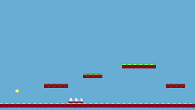
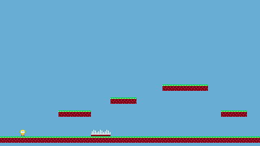
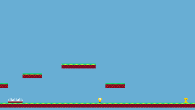

# Build a Platformer Game

This tutorial walks you through building a complete platformer with animated sprites, gravity, jumping, platform collision, and camera scrolling. It is the first big one, after [Your First Game](/learn/tutorials/first-game): it visits ART, MAP and CODE in turn and needs no second player.

Each step explains one idea and gives the code it adds, whole: a function is always shown from `function` to `end`, so it can be typed or pasted as it stands, and a function shown again replaces the one you had. By Step 7 the script is complete.

## What you will build

A side-scrolling platformer where the player can:

- Move left and right
- Jump between platforms
- Fall with gravity
- Respawn when falling off the screen
- Respawn when touching deadly tiles
- Win when touching the end tile

The camera follows the player horizontally. If you would rather start from the finished game, **Copy to new game** at the head of the page installs the code, the sprites, their flags and the map together.

## Step 1: Prepare your sprites

### Draw the seven sprites

Open **ART**. A click on a cell of the SHEET map, at the right, selects that sprite, and PREVIEW over the canvas reads its number, such as `SPRITE 032`. Draw these seven:

| Sprite index | Content                            |
|--------------|------------------------------------|
| `0`          | Player standing (idle)             |
| `1`          | Player walking frame 1             |
| `2`          | Player walking frame 2             |
| `3`          | Player jumping                     |
| `32`         | Solid ground/platform tile         |
| `33`         | Deadly tile, such as spikes        |
| `34`         | End tile, such as a trophy or door |

The player character is **8 pixels wide and 8 pixels tall** (1 tile wide, 1 tile tall). Each player animation frame fits in a single sprite slot. The swatches under PALETTE are numbered from `0`, left to right, the top row first; the number shows once a swatch is clicked.


A new game does not start empty: the starter moon sits in sprites `1`, `2`, `17` and `18`, and the starter script in CODE moves it around. Drawing the walk frames over `1` and `2` is intended; clear `17` and `18` too if you like (this game never draws them). The starter script goes as well: Step 3 replaces it from the first line.

### Set the flags

Under the SHEET map, in the right column, the **FLAGS** panel shows eight buttons numbered `0` to `7`. Select each tile sprite and turn on one of them:

- sprite `32` (solid): button `0`
- sprite `33` (deadly): button `1`
- sprite `34` (end): button `2`

The engine ignores flags; your code reads them in Step 3 with [[map.flag]], and what each bit means is your decision.


> [!TIP]
> You can use any sprite indexes you want. Just update the constants at the top of the script to match and enable the same flag bits on the matching tile sprites.

## Step 2: Paint your level

Open **MAP**. Click a tile in the TILE PICKER of the right column, then paint it with the Stamp tool, the one selected when the tab opens:

- a ground row: a full row of solid tiles across the bottom
- floating platforms: smaller groups of tiles at different heights
- deadly tiles: a few spikes or hazards that send the player back to the start
- an end tile: the tile the player touches to win

Example layout (each cell = 8 pixels):

```
Row 17 (y=136): platform at columns 9-13
Row 15 (y=120): platform at columns 17-20
Row 13 (y=104): platform at columns 25-31
Row 17 (y=136): platform at columns 34-37
Row 20 (y=160): deadly tiles at columns 14-16
Row 20 (y=160): end tile at column 50
Row 21 (y=168): ground spanning columns 0-52
```

The map is `128` tiles wide and the window shows its left part only. The wheel scrolls the map up and down; <kbd>Shift</kbd> and the wheel, or a horizontal wheel, scroll it **sideways**, about eight tiles a notch, which is how the columns past the edge come into view. The status line at the bottom of the map reads the tile under the cursor, `TILE 50,20 · SPR 034`: the column, the row and the sprite painted there, so a column is found without counting.

> [!TIP]
> The **Flags** button of MAP tints every tile by the first flag set on its sprite. Switch it on to check Step 1 at a glance: the ground and platforms in one colour, the spikes in another, the end tile in a third. A tile with no tint carries no flag, and the player will fall through it.


## Step 3: Read the map as collision

There is no separate collision data in this game: the painted map is the collision data. Switch to **CODE**, delete the starter script, and start with constants for everything Step 1 and 2 decided: the four player sprites, the player size, the tile size, the map size (`128 x 32`, the default), the number of sprites, and one constant per flag bit.

``` lua
SPRITE_IDLE   = 0
SPRITE_WALK_1 = 1
SPRITE_WALK_2 = 2
SPRITE_JUMP   = 3

PLAYER_W = 8
PLAYER_H = 8

TILE_SIZE  = 8
MAP_W      = 128
MAP_H      = 32
SPRITE_COUNT = 256
FLAG_SOLID = 0
FLAG_KILL  = 1
FLAG_END   = 2
```

A helper first, for later: `clamp` keeps a number between two bounds. Step 7 uses it for the camera.

``` lua
function clamp(v, lo, hi)
  if v < lo then return lo end
  if v > hi then return hi end
  return v
end
```

### One question everything asks

Then the one function everything else leans on: does the tile at `(tx, ty)` carry this flag?

``` lua
function tile_has_flag(tx, ty, flag)
  if tx < 0 or tx >= MAP_W or ty < 0 or ty >= MAP_H then
    return false
  end

  local sprite_index = map.get(tx, ty)
  if type(sprite_index) ~= "number" then
    return false
  end

  if sprite_index < 0 or sprite_index >= SPRITE_COUNT then
    return false
  end

  return map.flag(sprite_index, flag)
end
```

The bounds guard is not decoration. [[map.get]] outside the map returns `0`, and sprite `0` is a real sprite: without the guard, every tile above the map reads as sprite `0` and inherits whatever flags you gave it, and a solid sprite `0` puts an **invisible ceiling** over the whole level. Treating everything out of bounds as "no flag" makes the world edges simply empty. This is also why `MAP_W` / `MAP_H` must match your game's real map size.

The sprite guard is cheaper insurance. Flags live on the first sheet: [[map.flag]] on an index past it, or on a sprite of a sheet you added, reads as no flags rather than failing. The guard only makes that explicit.

### Two thin helpers

`is_solid_tile` is shorthand for the `FLAG_SOLID` check, which the movement code asks many times a frame:

``` lua
function is_solid_tile(tx, ty)
  return tile_has_flag(tx, ty, FLAG_SOLID)
end
```

`player_touching_flag` converts the player's four corners to tile coordinates, then walks that rectangle of tiles and answers `true` on the first one that carries the flag. The right and bottom edges use `+ PLAYER_W - 1` and `+ PLAYER_H - 1`: an 8-pixel body covers pixels `x` to `x + 7`, and one more would read the tile next door.

``` lua
function player_touching_flag(flag)
  local left_tile   = math.floor(player.x / TILE_SIZE)
  local right_tile  = math.floor((player.x + PLAYER_W - 1) / TILE_SIZE)
  local top_tile    = math.floor(player.y / TILE_SIZE)
  local bottom_tile = math.floor((player.y + PLAYER_H - 1) / TILE_SIZE)

  for ty = top_tile, bottom_tile do
    for tx = left_tile, right_tile do
      if tile_has_flag(tx, ty, flag) then
        return true
      end
    end
  end

  return false
end
```

Nothing calls these yet, so Play shows an empty screen; the player comes next.

## Step 4: A player made of numbers

The player is one global table, filled in `_init()`: a position, a velocity, and the tuning values. Speeds are per step (1/60 s, see [[sys.dt]]), so the numbers are small: `speed = 1.8`, `gravity = 0.30`, `jump_force = -5.0` (negative is up), `max_fall = 5.5`. `on_ground` starts `false`; `facing` remembers the last direction; `anim_frame` is the sprite drawn. Two more globals live beside it: `anim_timer`, which Step 7 counts, and `game_finished`, which Step 6 sets.

``` lua
player = {}
anim_timer = 0
game_finished = false

function _init()
  player = {
    x          = 24,
    y          = 40,
    vx         = 0,
    vy         = 0,
    speed      = 1.8,
    gravity    = 0.30,
    jump_force = -5.0,
    max_fall   = 5.5,
    on_ground  = false,
    facing     = 1,
    anim_frame = SPRITE_IDLE,
  }
  anim_timer = 0
  game_finished = false
end
```

### Input

`handle_input` resets `vx` to `0` each frame, then sets it to `-speed` or `speed` on <kbd>ArrowLeft</kbd> / <kbd>ArrowRight</kbd> (`a` / `d` do the same) and remembers the direction in `facing`. Jumping is <kbd>ArrowUp</kbd>, `w` or <kbd>Space</kbd>. The only subtle line is the jump: gating on `on_ground` is what makes it a **jump rather than a jetpack**, and the flag comes back in Step 5.

``` lua
function handle_input()
  player.vx = 0

  if input.key_pressed("ArrowLeft") or input.key_pressed("a") then
    player.vx    = -player.speed
    player.facing = -1
  end

  if input.key_pressed("ArrowRight") or input.key_pressed("d") then
    player.vx    = player.speed
    player.facing = 1
  end

  local wants_jump = input.key_pressed("ArrowUp")
                  or input.key_pressed("w")
                  or input.key_pressed(" ")
  if wants_jump and player.on_ground then
    player.vy        = player.jump_force
    player.on_ground = false
  end
end
```

> [!NOTE]
> The code reads keys by name with [[input.key_pressed]], and `a` / `d` / `w` are QWERTY positions. On another layout the arrow keys and <kbd>Space</kbd> still work; [[input.held]] with `"left"` / `"right"` / `"up"` would follow the player's own bindings instead.

### A first loop

To see something, the minimal loop: `_update` reads the input, then applies gravity and the velocity; `_draw` clears with a sky colour (`11`, the light blue of the default palette), draws the map, and draws the player with the sprite `anim_frame` names.

``` lua
function _update()
  handle_input()

  player.vy = player.vy + player.gravity
  if player.vy > player.max_fall then
    player.vy = player.max_fall
  end

  player.x = player.x + player.vx
  player.y = player.y + player.vy
end
```

``` lua
function _draw()
  gfx.clear(11)
  map.draw(0, 0)
  gfx.draw_sprite(player.anim_frame, player.x, player.y, 1, 1)
end
```

> [!TRY]
> Press Play. You can steer left and right while the player falls straight through your level and off the screen. Collision is the next step.



## Step 5: Move one axis at a time

Resolving X and Y movement separately is the classic trick that keeps tile collision simple: after each single-axis move, any overlap can only have come from **that axis**, so you know exactly which way to push the player out.

### The X pass

Move first, test the leading edge, and on a hit snap flush against the tile and zero the velocity. Moving right, the leading edge is the column of tiles under the player's right side; moving left, the column under its left side, and the snap puts the player just past that column.

``` lua
function move_x()
  player.x = player.x + player.vx

  local top_tile    = math.floor(player.y / TILE_SIZE)
  local bottom_tile = math.floor((player.y + PLAYER_H - 1) / TILE_SIZE)

  if player.vx > 0 then
    local right_tile = math.floor((player.x + PLAYER_W - 1) / TILE_SIZE)

    for ty = top_tile, bottom_tile do
      if is_solid_tile(right_tile, ty) then
        player.x  = right_tile * TILE_SIZE - PLAYER_W
        player.vx = 0
        break
      end
    end
  elseif player.vx < 0 then
    local left_tile = math.floor(player.x / TILE_SIZE)

    for ty = top_tile, bottom_tile do
      if is_solid_tile(left_tile, ty) then
        player.x  = (left_tile + 1) * TILE_SIZE
        player.vx = 0
        break
      end
    end
  end
end
```

### The Y pass

`move_y` follows the same pattern, and gravity with its `max_fall` cap moves in here from Step 4's `_update`. It has three extra responsibilities. `on_ground` is set to `false` right after the move, before the tests. Falling, the row under the player's feet is tested at `y + PLAYER_H` with no `- 1`, since the tile below is what is being probed; on a hit the player snaps on top, `vy` goes to zero and `on_ground` comes back `true`, which is what re-arms the jump. Rising, the row at `player.y` is tested and the player bumps its head. The function closes with the fell-off-the-world check: below `260` (the map is `32 x 8 = 256` pixels tall), the player respawns.

``` lua
function move_y()
  player.vy = player.vy + player.gravity
  if player.vy > player.max_fall then
    player.vy = player.max_fall
  end

  player.y         = player.y + player.vy
  player.on_ground = false

  local left_tile  = math.floor(player.x / TILE_SIZE)
  local right_tile = math.floor((player.x + PLAYER_W - 1) / TILE_SIZE)

  if player.vy > 0 then
    local bottom_tile = math.floor((player.y + PLAYER_H) / TILE_SIZE)

    for tx = left_tile, right_tile do
      if is_solid_tile(tx, bottom_tile) then
        player.y         = bottom_tile * TILE_SIZE - PLAYER_H
        player.vy        = 0
        player.on_ground = true
        break
      end
    end
  elseif player.vy < 0 then
    local top_tile = math.floor(player.y / TILE_SIZE)

    for tx = left_tile, right_tile do
      if is_solid_tile(tx, top_tile) then
        player.y  = (top_tile + 1) * TILE_SIZE
        player.vy = 0
        break
      end
    end
  end

  if player.y > 260 then
    respawn_player()
  end
end
```

`respawn_player` puts the player back where `_init` did, still, and in the air:

``` lua
function respawn_player()
  player.x         = 24
  player.y         = 40
  player.vx        = 0
  player.vy        = 0
  player.on_ground = false
  player.anim_frame = SPRITE_IDLE
end
```

`_update` becomes the three calls, and the gravity lines it had are gone, since `move_y` now owns them:

``` lua
function _update()
  handle_input()
  move_x()
  move_y()
end
```

> [!TRY]
> You should be able to land on the ground row, run, jump onto platforms, bump your head, and respawn after walking off a ledge. Tune `gravity` / `jump_force` until the jump arc feels right; this is the moment to do it.



## Step 6: Tiles with meaning

The deadly and end tiles reuse the machinery from Step 3. `win_game` sets `game_finished`, stops the player, and announces the win with `print`, the same call as [[sys.log]], which writes to the console; [[gfx.print]] would put it on the canvas instead, in a 4x6 font. The early return is what makes it **fire once**.

``` lua
function win_game()
  if game_finished then
    return
  end

  game_finished = true
  player.vx     = 0
  player.vy     = 0

  print("You Won")
end
```

`check_special_tiles` asks the two questions in order: a deadly tile respawns the player and stops there, an end tile wins.

``` lua
function check_special_tiles()
  if player_touching_flag(FLAG_KILL) then
    respawn_player()
    return
  end

  if player_touching_flag(FLAG_END) then
    win_game()
  end
end
```

`_update` calls it after `move_y`, and does nothing at all once `game_finished` is set. `_draw` keeps running, so the world stays frozen on screen rather than going blank.

``` lua
function _update()
  if game_finished then
    return
  end

  handle_input()
  move_x()
  move_y()
  check_special_tiles()
end
```

> [!TRY]
> Walk into the spikes: the player is back at the start. Reach the end tile, past the right edge of the screen until Step 7 brings the camera: the console under the game screen prints `You Won` and the player stops moving.


## Step 7: Animation and a camera

Both of these are presentation on top of state you already track.

### Animation

Animation is picking `player.anim_frame` from what the player is doing: airborne (`not on_ground`) shows `SPRITE_JUMP`; standing still shows `SPRITE_IDLE`; walking alternates the two walk frames, by counting `anim_timer` up each frame and flipping every 8 ticks. The timer resets when the player stands still.

``` lua
function update_animation()
  if not player.on_ground then
    player.anim_frame = SPRITE_JUMP
    return
  end

  if player.vx ~= 0 then
    anim_timer = anim_timer + 1
    if anim_timer >= 8 then
      anim_timer = 0
      if player.anim_frame == SPRITE_WALK_1 then
        player.anim_frame = SPRITE_WALK_2
      else
        player.anim_frame = SPRITE_WALK_1
      end
    end
  else
    player.anim_frame = SPRITE_IDLE
    anim_timer = 0
  end
end
```

It runs at the end of `_update`, **after the special-tile check**, so a game won on this very frame does not keep animating:

``` lua
function _update()
  if game_finished then
    return
  end

  handle_input()
  move_x()
  move_y()
  check_special_tiles()

  if game_finished then
    return
  end

  update_animation()
end
```


### The camera

The camera is one line at the top of `_draw`, and the clamp from Step 3 is the whole art. `player.x - 160` centres a 320-pixel screen on the player; the clamp stops the view from sliding past either end of the map. Everything drawn afterwards, the map and the player, shifts automatically. Drawing the player gets a function of its own, so the loop reads as what it does.

``` lua
function draw_player()
  gfx.draw_sprite(player.anim_frame, player.x, player.y, 1, 1)
end

function _draw()
  gfx.camera(clamp(player.x - 160, 0, MAP_W * TILE_SIZE - 320), 0)
  gfx.clear(11)
  map.draw(0, 0)
  draw_player()
end
```

> [!TRY]
> Run to the end tile. Walk frames alternate as you move, the jump sprite shows in the air, the camera follows without ever exposing the void beyond the map edges, and touching the trophy prints "You Won" and freezes the action.



## How it all fits together

{{svg:img/platformer-parts.svg}}

## Extending the example

- Coins: paint coin tiles on the map, give them a flag bit of their own, and detect them with [[map.get]] and [[map.flag]].
- Enemies: add an `enemies` table, update positions each frame, draw them with [[gfx.draw_sprite]].
- Bigger player: draw a 2x2 sprite and call `gfx.draw_sprite(index, x, y, 2, 2)`.
- Animated tiles: tint selected colours each frame with [[gfx.set_col]] (and [[gfx.reset_col]] after).
- Level restart: track a `lives` variable and reset the player on death.
