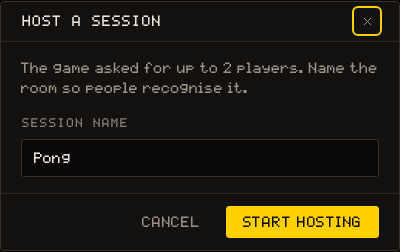
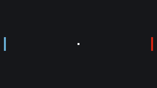
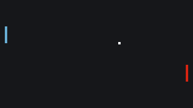
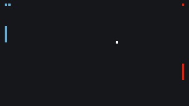

# Build Multiplayer Pong

This tutorial builds a complete two-player online Pong: one player hosts, a friend joins, and each controls a paddle on their own machine. It is the best place to start with the `net` API; read the [multiplayer](/learn/concepts/multiplayer) concepts page first if you have not.

Each step explains one idea and gives the functions that carry it, whole, so the game runs at the end of every step and each Try box says what to look for. Six steps take it from an empty menu to a match.

## What you will build

- A menu where the player chooses to host or join a session
- Two paddles, each controlled by its own player, shared through `net.state`
- A ball simulated by the host and replicated to the other player
- A score, point announcements via `net.emit`, and a win condition
- Clean handling of the opponent leaving

No sprites or map are needed: the whole game is drawn with [[gfx.fill_rect]] and [[gfx.rect]], so you can go straight to **CODE**. Copy to new game, at the head of this page, installs the finished game in a project of your own, to compare against or to play straight away.

## Step 1: Four states

A multiplayer game cannot jump straight into gameplay: the session has to be created first, and that involves a platform dialog the player can cancel. So the game is a small **state machine**. Start with the constants, the three globals every later step reads, and the `clamp` helper:

``` lua
W, H       = 320, 180
PAD_W      = 4
PAD_H      = 28
PAD_SPEED  = 3
BALL_SIZE  = 4
WIN_SCORE  = 5

COL_BG    = 0    -- black
COL_LEFT  = 11   -- light blue
COL_RIGHT = 2    -- red
COL_BALL  = 5    -- white

state   = "menu"   -- "menu" | "waiting" | "playing" | "over"
is_host = false
side    = nil      -- "left" (host) or "right" (joiner)

function _init()
  state   = "menu"
  is_host = false
  side    = nil
  print("Press H to host a game, J to join one")
end

function clamp(v, lo, hi)
  if v < lo then return lo end
  if v > hi then return hi end
  return v
end
```

`state` says which screen the game is on, `is_host` whether we are the one who created the session, and `side` (`"left"` or `"right"`) which paddle is ours. `_init()` resets all three and prints the menu instructions, and the palette colours for each side are `11` (light blue) for the left paddle and `2` (red) for the right.

Then dispatch on `state` every frame. The four update functions stay empty for now; the next steps fill them one at a time:

``` lua
function update_menu()
end

function update_waiting()
end

function update_playing()
end

function update_over()
end
```

``` lua
function _update()
  if state == "menu" then
    update_menu()
  elseif state == "waiting" then
    update_waiting()
  elseif state == "playing" then
    update_playing()
  elseif state == "over" then
    update_over()
  end
end
```

> [!NOTE]
> Menus and announcements go to the console with [[sys.log]] rather than onto the canvas. [[gfx.print]] does draw text, but in a 4x6 font sized for a score, not for a paragraph of instructions.

## Step 2: Hosting and joining

`net.host` and `net.join` open a platform dialog and return immediately; your callback fires only if the session is actually created or joined. That asymmetry drives the whole menu design. Two rules to encode:

1. Switch state before calling. A repeat `net.host` on the next frame while the dialog is still open is silently ignored, a no-op rather than an error (an error is raised only if a session is already active). Moving to `"waiting"` first keeps the game's state clear instead of firing the call unconditionally every frame.
2. Cancel means nothing fires. The only signal for "the player cancelled" is the absence of your callback, so give `"waiting"` its own inputs; otherwise a cancel strands the player there. Let them re-open host/join, or press a key to return to the menu.

``` lua
function update_menu()
  if input.key_pressed("h") then
    state   = "waiting"
    is_host = true
    net.host({ max_players = 2, title = "Pong" }, on_connected)
  elseif input.key_pressed("j") then
    state   = "waiting"
    is_host = false
    net.join(on_connected)
  end
end
```

In `"waiting"`, `m` returns to the menu and reprints the instructions, while `h` and `j` re-open the host or join dialog. Calling `net.host` or `net.join` again from here is safe, because a **cancelled attempt fully resets** the net state:

``` lua
function update_waiting()
  -- Cancelling a dialog fires no callback, so the game stays here. Let the
  -- player re-open host/join directly, or press M to return to the menu.
  if input.key_pressed("m") then
    state = "menu"
    print("Press H to host a game, J to join one")
  elseif input.key_pressed("h") then
    is_host = true
    net.host({ max_players = 2, title = "Pong" }, on_connected)
  elseif input.key_pressed("j") then
    is_host = false
    net.join(on_connected)
  end
end
```

The callback itself is Step 3's job. Until then, a placeholder that only prints lets the menu run:

``` lua
function on_connected()
  print("Connected!")
end
```

> [!TRY]
> Run the game and click its screen so it has the keyboard. The keys are case-sensitive ([[input.key_pressed]] reads the browser's `event.key`), so press lowercase `h`: the **Host a session** dialog opens, and its lead says the game asked for up to 2 players; the game decided that, not the player. Cancel it: `h` or `j` re-opens the dialog, and `m` takes you back to the menu.



## Step 3: The host sets the table

`on_connected` runs once, on success, for both roles; use `is_host` to split the work. Following the ownership convention from [multiplayer](/learn/concepts/multiplayer), the host creates **every piece of shared state** the game will ever read, so nobody else has to wonder whether a key exists. Both roles then derive `side` from `is_host`, subscribe to what they will listen to for the rest of the session, and switch to `"playing"`:

``` lua
function on_connected()
  side = is_host and "left" or "right"

  if is_host then
    net.state.pads    = { left = (H - PAD_H) / 2, right = (H - PAD_H) / 2 }
    net.state.score   = { left = 0, right = 0 }
    net.state.playing = false
    reset_ball(1)

    net.on("peer.joined", function(playerId)
      net.state.playing = true
      print("Player " .. playerId .. " joined -- game on!")
    end)

    net.on("peer.left", function(playerId)
      net.state.playing = false
      print("Player " .. playerId .. " left -- waiting for a new opponent")
    end)
  end

  net.on("event:point", function(from, scorer)
    print("Point for the " .. scorer .. " side!")
  end)

  net.on("ended", function()
    print("The host closed the session.")
    _init()
  end)

  state = "playing"
  print("Connected! You are the " .. side .. " paddle (arrow keys).")
end
```

`net.state.playing` is the referee's whistle: the ball only moves while an opponent is connected, and the host flips it from the `peer.joined` / `peer.left` events.

The two listeners both roles register are for later steps, but a session is the only place to register them, so they go in now. `"event:point"` is how the host will announce a point in Step 5. `"ended"` fires when the session dies, which is what happens when the host leaves: tell the player and call `_init()` to return to the menu, because `net.state` is gone with the session and the `"over"` screen reads it.

`reset_ball(direction)` assigns `net.state.ball` a fresh table with a centered `x, y` and a `dx, dy` velocity moving toward `direction`. Assigning a whole table **replaces the subtree** in one go, exactly what a reset wants:

``` lua
function reset_ball(direction)
  net.state.ball = {
    x  = (W - BALL_SIZE) / 2,
    y  = (H - BALL_SIZE) / 2,
    dx = 2 * direction,
    dy = 1.5,
  }
end
```

Nothing is drawn yet, so the place to see this step is the **NET** tab: once hosted, its SHARED STATE panel lists `pads`, `score`, `playing` and `ball`, every one of them owned by the host.

## Step 4: Your paddle, their paddle

Each player writes **only its own** paddle key and merely reads the other one; that is the entire synchronization model, no messages needed:

``` lua
function update_paddle()
  local pads = net.state.pads
  if not pads then
    return   -- state not replicated yet
  end

  local y = pads[side]
  if input.key_pressed("ArrowUp") then
    y = y - PAD_SPEED
  end
  if input.key_pressed("ArrowDown") then
    y = y + PAD_SPEED
  end

  pads[side] = clamp(y, 0, H - PAD_H)
end
```

The `nil` guard is not paranoia: the joiner's first frames can run before the host's state has replicated to it, and indexing a branch that does not exist yet would crash the game. **Guard every read** of a shared branch this way. Then call `update_paddle()` from `update_playing()`, or nothing moves:

``` lua
function update_playing()
  update_paddle()
end
```

Now make it visible. `draw_game()` draws both paddles from `net.state.pads`, with the same `nil` guard, and the ball from `net.state.ball`, but only while `net.state.playing` is true and nobody has won. Draw everything from `net.state`, never from local variables: that is what **guarantees both screens show the same game**. `_draw()` clears the screen and calls it in the `"playing"` state; the other states get their screens in Step 6:

``` lua
function draw_game()
  local pads = net.state.pads
  local ball = net.state.ball

  if pads then
    gfx.fill_rect(8, pads.left, PAD_W, PAD_H, COL_LEFT)
    gfx.fill_rect(W - 8 - PAD_W, pads.right, PAD_W, PAD_H, COL_RIGHT)
  end

  if ball and net.state.playing and not net.state.winner then
    gfx.fill_rect(ball.x, ball.y, BALL_SIZE, BALL_SIZE, COL_BALL)
  end
end

function _draw()
  gfx.clear(COL_BG)

  if state == "playing" then
    draw_game()
  end
end
```

### Testing with two clients

Hosting shows a JOIN CODE; the other player pastes it under HAVE A CODE? in the Join a session dialog. Alone, use the NET tab's Test rig, which spawns a second client on your machine. Three things to know before you press its button:

- On the NET tab your own game is paused unless the VIEWER is popped out. Pop it out first, from the button at the top of the CODE tab's console column, and host from the floating viewer.
- Turn **Auto** off, in the same column: an edit reruns the game, and a rerun ends the session.
- **Spawn a second client** opens a second copy of the game as a small screen inside the TEST RIG panel, not a window. Click inside that screen to give it the keyboard: it starts at `_init` like any run and has to reach `net.join()` through its own menu, so press `j` there. The panel says `Waiting for this client to call net.join()` until it does, and the join lands straight in your session, no code needed.

That client runs on your account but plays under an id of its own; Pong never looks at ids anyway, only at `side`.

> [!TRY]
> Host, then join from the second client. You should see both paddles on both screens, each controlling its own, and the ball sitting frozen in the center, because nothing moves it yet.



## Step 5: The host runs the ball

Only the host runs ball physics; the other player just draws the replicated result. One referee means the two screens can never disagree about a bounce. Note what the first lines give you: `net.state.ball` is a **live view**, so writing `ball.x` goes straight into shared state, and the physics is classic Pong:

``` lua
function update_ball()
  if not net.state.playing or net.state.winner then
    return
  end

  local ball = net.state.ball
  local pads = net.state.pads

  ball.x = ball.x + ball.dx
  ball.y = ball.y + ball.dy

  -- Bounce off the top and bottom
  if ball.y <= 0 or ball.y >= H - BALL_SIZE then
    ball.dy = -ball.dy
  end

  -- Bounce off the paddles
  if ball.dx < 0 and ball.x <= 8 + PAD_W
     and ball.y + BALL_SIZE >= pads.left and ball.y <= pads.left + PAD_H then
    ball.dx = -ball.dx
  elseif ball.dx > 0 and ball.x + BALL_SIZE >= W - 8 - PAD_W
     and ball.y + BALL_SIZE >= pads.right and ball.y <= pads.right + PAD_H then
    ball.dx = -ball.dx
  end

  -- Out on the left: right scores (and vice versa)
  if ball.x < -BALL_SIZE then
    score_point("right", 1)
  elseif ball.x > W then
    score_point("left", -1)
  end
end
```

- Walls: when `ball.y` leaves `0 .. H - BALL_SIZE`, `dy` flips.
- Paddles: when the ball moves left (`dx < 0`), reaches the left paddle's x-plane, and overlaps it vertically, `dx` flips; the test is mirrored for the right side.
- Goals: when the ball fully exits on the left, the right side scores, and vice versa.

### Scoring

Scoring is where the host talks to the other player. The **sender of an event never receives it**, hence the local [[sys.log]] next to the emit; the other side hears it through the `"event:point"` listener from Step 3:

``` lua
function score_point(scorer, serve_direction)
  net.state.score[scorer] = net.state.score[scorer] + 1
  net.emit("point", scorer)
  print("Point for the " .. scorer .. " side!")

  if net.state.score[scorer] >= WIN_SCORE then
    net.state.winner = scorer
  else
    reset_ball(serve_direction)
  end
end
```

Finally, wire it into `update_playing()`: everyone updates their paddle; only the host calls `update_ball()`:

``` lua
function update_playing()
  update_paddle()

  if is_host then
    update_ball()
  end
end
```



## Step 6: Winning and leaving

The host decides the winner by writing `net.state.winner`; everyone else just watches for it. At the end of `update_playing()`, when `net.state.winner` is set, switch to `"over"` and announce the result. In `update_over()`, `m` cleans up and restarts:

``` lua
function update_playing()
  update_paddle()

  if is_host then
    update_ball()
  end

  if net.state.winner then
    state = "over"
    print("The " .. net.state.winner .. " side wins! Press M for the menu.")
  end
end

function update_over()
  if input.key_pressed("m") then
    net.leave()
    _init()
  end
end
```

`"over"` is only ever reached through a win, with the session still alive. The other way out, the host leaving, never gets there: the `"ended"` handler from Step 3 goes **straight back to the menu**, because the `"over"` screen reads `net.state.winner` and the session is gone by then.

### The other screens

A score display needs no text: `draw_score()` draws one small square per point in each side's colour along the top edge. Then `_draw()` grows its other states: the screen filled with the winner's colour in `"over"`, and two idle paddles with a dotted center line for the menu:

``` lua
function draw_score()
  local score = net.state.score
  if not score then
    return
  end

  for i = 1, score.left do
    gfx.fill_rect(8 + (i - 1) * 6, 6, 4, 4, COL_LEFT)
  end
  for i = 1, score.right do
    gfx.fill_rect(W - 8 - (i - 1) * 6 - 4, 6, 4, 4, COL_RIGHT)
  end
end

function _draw()
  gfx.clear(COL_BG)

  if state == "playing" then
    draw_game()
    draw_score()
  elseif state == "over" and net.state.winner then
    -- Fill the screen with the winner's color
    local col = net.state.winner == "left" and COL_LEFT or COL_RIGHT
    gfx.fill_rect(0, 0, W, H, col)
  else
    -- Menu / waiting: a centered "net" between two idle paddles
    gfx.fill_rect(8, (H - PAD_H) / 2, PAD_W, PAD_H, COL_LEFT)
    gfx.fill_rect(W - 8 - PAD_W, (H - PAD_H) / 2, PAD_W, PAD_H, COL_RIGHT)
    for y = 0, H - 8, 12 do
      gfx.fill_rect(W / 2 - 1, y, 2, 8, 5)
    end
  end
end
```

> [!TRY]
> Play a full match to 5. Then start again and, mid-rally, press **End session** in the NET tab's SESSION column: your own game restarts, and the second client prints "The host closed the session." and lands straight back in its menu. That path, session dies, `"ended"` fires, player recovers, is one your game should never leave untested.



## How it all fits together

{{svg:img/pong-roles.svg}}

## Extending the example

- Rematch: on the "over" screen, let the host reset the score and ball instead of leaving.
- Faster rallies: increase `ball.dx` slightly on each paddle bounce.
- Spin: adjust `ball.dy` based on where the ball hits the paddle.
- Sound: call [[sound.play_music]] on `event:point` if your project has music slots.
