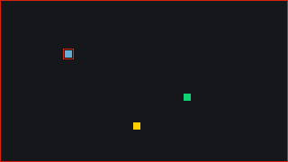
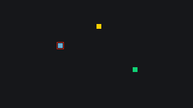

# Build a Tag Arena

A four-player game of tag: everyone runs around the arena, one player is "it", and touching someone passes it on. This tutorial focuses on playing with **more than two peers**: reacting to [[net.state]] changes with `net.on`, handling players who join mid-game, and cleaning up after players who leave. Do [Pong](/learn/tutorials/pong) and [Coin Rush](/learn/tutorials/click-race) first; the session menu comes from the former and the host-provisioning pattern from the latter, and this tutorial only explains what is new.

Each step gives the functions that carry it, whole, so the game runs at the end of every step.

## What you will build

- A host/join menu for up to four players
- One coloured square per player; whoever is "it" gets a red ring
- Host-refereed tagging, announced through a `net.state` change listener
- A taunt button using `net.emit`
- Correct behaviour when players join mid-game or leave (even the tagged one)

Everything is drawn with [[gfx.fill_rect]] and [[gfx.rect]]; no sprites needed. Copy to new game, at the head of this page, installs the finished game in a project of your own.

## Step 1: Assemble the known parts

### The menu

The state machine is Pong's: `"menu" | "waiting" | "playing" | "over"`, dispatched from `_update()` the way Coin Rush does it, with `m` leaving the session straight from `"over"`. The menu differs only in seats and title:

``` lua
function update_menu()
  if input.key_pressed("h") then
    state   = "waiting"
    is_host = true
    net.host({ max_players = 4, title = "Tag arena" }, on_connected)
  elseif input.key_pressed("j") then
    state   = "waiting"
    is_host = false
    net.join(on_connected)
  end
end
```

`update_waiting()` is the same as in Pong with the same host line, and `on_connected()` starts as a placeholder that prints, until Step 2.

### The players

The host provisions every player, as in Coin Rush, minus the `score` field. The first entry has to **create the branch**:

``` lua
function provision_player(playerId)
  local entry = {
    x   = math.random(8, W - 8 - PLAYER_SIZE),
    y   = math.random(8, H - 8 - PLAYER_SIZE),
    col = COLORS[next_color],
  }
  next_color = next_color % #COLORS + 1

  -- The first entry has to create the players branch (see the net.state
  -- reference); later ones write through it
  if net.state.players then
    net.state.players[playerId] = entry
  else
    net.state.players = { [playerId] = entry }
  end
end
```

`my_player()` returns `net.state.players[net.id()]`, or `nil` while the branch is missing, and `update_movement()` moves it with the arrow keys, clamped to the screen. One thing is new: the chaser's reward. `IT_SPEED` sits slightly above `SPEED`, and the speed is picked by role, from the single shared key the next step explains:

``` lua
function my_player()
  local players = net.state.players
  if not players then
    return nil
  end
  return players[net.id()]
end

function update_movement()
  local me = my_player()
  if not me then
    return   -- not provisioned yet
  end

  local speed = SPEED
  if net.state.it == net.id() then
    speed = IT_SPEED
  end

  if input.key_pressed("ArrowLeft")  then me.x = me.x - speed end
  if input.key_pressed("ArrowRight") then me.x = me.x + speed end
  if input.key_pressed("ArrowUp")    then me.y = me.y - speed end
  if input.key_pressed("ArrowDown")  then me.y = me.y + speed end

  me.x = clamp(me.x, 0, W - PLAYER_SIZE)
  me.y = clamp(me.y, 0, H - PLAYER_SIZE)
end

function update_playing()
  update_movement()
end
```

The constants and locals for this game: `IT_SPEED`, `TAG_COOLDOWN = 60` frames, `tag_cooldown` (host only) and `taunt_timer`, plus an AABB overlap test between two players, `overlaps(a, b)`, the rectangle test explained in [limitations](/learn/reference/limitations):

``` lua
W, H         = 320, 180
PLAYER_SIZE  = 8
SPEED        = 2
IT_SPEED     = 2.4          -- "it" runs slightly faster
TAG_COOLDOWN = 60           -- frames before "it" can tag again (one second)

COL_BG  = 0                 -- black
COL_IT  = 2                 -- red
COLORS  = { 11, 13, 4, 6 }  -- light blue, green, yellow, pink

state        = "menu"       -- "menu" | "waiting" | "playing" | "over"
is_host      = false
next_color   = 1            -- host only
tag_cooldown = 0            -- host only
taunt_timer  = 0

function _init()
  state        = "menu"
  is_host      = false
  next_color   = 1
  tag_cooldown = 0
  taunt_timer  = 0
  print("Press H to host a game, J to join one")
end

function clamp(v, lo, hi)
  if v < lo then return lo end
  if v > hi then return hi end
  return v
end

function overlaps(a, b)
  return a.x < b.x + PLAYER_SIZE and a.x + PLAYER_SIZE > b.x
     and a.y < b.y + PLAYER_SIZE and a.y + PLAYER_SIZE > b.y
end
```

## Step 2: Who is "it"

The entire game state specific to Tag is a single shared key, `net.state.it`, the player id of the chaser. The host declares itself "it" at session start (`net.state.it = net.id()`, right after provisioning itself).

The interesting part is how everyone reacts to it. Instead of sending an event when a tag happens, every peer **listens to the key**. State your facts, listen for changes: compared with announcing tags via `net.emit`, this keeps late joiners correct for free, because an event fired before they arrived is gone forever, but the current `it` is right there in their state snapshot.

### Departures

With more than two players, cleanup is a real concern, and the departed player might be the chaser. Only the host registers `peer.left` (it owns the players branch): it removes the square, and if "it" left, takes the role over. Both roles subscribe to `"ended"` as usual, and to `"event:taunt"`, which Step 4 sends:

``` lua
function on_connected()
  if is_host then
    provision_player(net.id())
    net.state.it = net.id()

    net.on("peer.joined", function(playerId)
      provision_player(playerId)
      print("Player " .. playerId .. " joined the arena")
    end)

    net.on("peer.left", function(playerId)
      net.state.players[playerId] = nil
      if net.state.it == playerId then
        net.state.it = net.id()   -- "it" left: the host takes over
      end
      print("Player " .. playerId .. " left")
    end)
  end

  -- Everyone announces tags by listening to the shared "it" key
  net.on("it", function(path, value)
    if value == net.id() then
      print("You are it! Catch someone!")
    else
      print("Player " .. value .. " is it -- run!")
    end
  end)

  net.on("event:taunt", function(from)
    print("Player " .. from .. " taunts you!")
  end)

  net.on("ended", function()
    print("The host closed the session.")
    _init()
  end)

  state = "playing"
  print("Connected as player " .. net.id() .. " (arrow keys; SPACE to taunt).")
end
```

One detail of the order: the host writes `net.state.it` before it registers the `"it"` listener, so the host never sees "You are it!" at the start. A listener fires for the writer's own changes too, so from the first tag on the host is announced like everyone else.

### Seeing who is "it"

`draw_players()` rings the entry whose `tonumber(id)` equals `net.state.it` with a red [[gfx.rect]], and `_draw()` adds a red border around the whole arena when it is you:

``` lua
function draw_players()
  for id, p in pairs(net.state.players or {}) do
    gfx.fill_rect(p.x, p.y, PLAYER_SIZE, PLAYER_SIZE, p.col)

    if tonumber(id) == net.state.it then
      gfx.rect(p.x - 2, p.y - 2, PLAYER_SIZE + 4, PLAYER_SIZE + 4, COL_IT)
    end
  end
end

function _draw()
  gfx.clear(COL_BG)

  if state == "playing" or state == "over" then
    draw_players()

    -- Red arena border when you are the one chasing
    if net.state.it == net.id() then
      gfx.rect(0, 0, W, H, COL_IT)
    end
  else
    for i = 1, #COLORS do
      gfx.fill_rect(60 * i + 20, (H - PLAYER_SIZE) / 2, PLAYER_SIZE, PLAYER_SIZE, COLORS[i])
    end
  end
end
```

> [!TRY]
> Run two or three clients (the Test rig, set up as in Pong's [Testing with two clients](/learn/tutorials/pong#testing-with-two-clients), gives you the second): every square moves, and every screen agrees on who wears the ring. The host's screen has the border; the others print "Player … is it -- run!" in their console.



## Step 3: The host referees tags

Who decides a touch happened? If everyone did, two players could disagree by a frame and "it" would flicker. **One referee**, the host, scans for contact and writes the single shared fact; the cooldown stops the tag from bouncing straight back:

``` lua
function update_tagging()
  if tag_cooldown > 0 then
    tag_cooldown = tag_cooldown - 1
    return
  end

  local players = net.state.players
  if not players then
    return
  end

  local it = players[net.state.it]
  if not it then
    return
  end

  for id, p in pairs(players) do
    if tonumber(id) ~= net.state.it and overlaps(it, p) then
      net.state.it = tonumber(id)   -- everyone's "it" listener fires
      tag_cooldown = TAG_COOLDOWN
      break
    end
  end
end
```

Note the familiar details doing their job: string `pairs` keys converted with `tonumber`, and `nil` guards on both the branch and the "it" entry (the chaser might have just disconnected). Call it from `update_playing()` inside the `is_host` branch:

``` lua
function update_playing()
  update_movement()

  if is_host then
    update_tagging()
  end
end
```

## Step 4: A taunt event

Not everything belongs in `net.state`. A taunt is a one-shot moment with no lasting truth, exactly what `net.emit` is for. On <kbd>Space</kbd>, with a one-second local cooldown so holding the key does not spam; the timer counts down every frame, so `update_taunt()` runs from `update_playing()` for everyone:

``` lua
function update_taunt()
  taunt_timer = taunt_timer - 1

  if input.key_pressed(" ") and taunt_timer <= 0 then
    taunt_timer = 60   -- once per second at most
    net.emit("taunt")
    print("You taunt everyone!")
  end
end
```

``` lua
function update_playing()
  update_movement()
  update_taunt()

  if is_host then
    update_tagging()
  end
end
```

The `"event:taunt"` listener from Step 2 prints who taunted you (the `from` argument). The local `print` next to the emit is the usual reminder that **senders never receive** their own events.



## Step 5: Play with three or four

Like Coin Rush, Tag keys players by `net.id()`, and the NET tab's Test rig joins under an id of its own, so host plus rig is a **two-player game** on one machine. For three or four, use other browsers logged in as other accounts, or friends.

1. Host, and in the Host a session dialog switch on **Listed in browse** (it is off by default). The session then appears under PUBLIC in the others' Join a session dialog; without it they need the JOIN CODE.
2. Let one player join after the game has been running: they appear instantly with the right positions and the right "it", the state snapshot doing its job.
3. Close the tab of the player who is "it": the host's `peer.left` removes their square and takes the "it" role back.
4. Close the host's tab instead: everyone else prints "The host closed the session." and returns to the menu.

## How it all fits together

{{svg:img/tag-roles.svg}}

## Extending the example

- Freeze tag: tagged players stop moving until a teammate touches them; store a `frozen` flag per player, written by the host.
- Score by survival: the host counts the frames each player spends not being it in `net.state.players.<id>.score`.
- Obstacles: draw a wall layout with [[gfx.fill_rect]] and block movement against it; keep the layout in constants so every client agrees.
- Round timer: the host counts down in `net.state.time_left`; whoever is "it" at zero loses.
